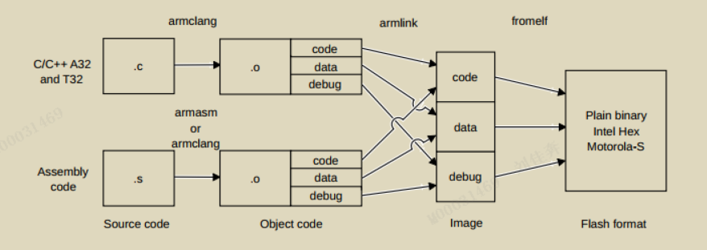

# Complier User Guide


# 2 Start

## 2.1 Introduction

Arm®Compiler for Embedded 6是来自Arm for Arm®Cortex®和Arm®Neoverse®处理器的最先进的C和c++编译工具链。

Arm Compiler for Embedded 6是在**Arm架构**下开发的。因此，Arm Compiler for Embedded 6被**调整**为为嵌入式裸机应用程序(从小型传感器到64位设备)生成**高效**代码。

Arm Compiler for Embedded 6是Arm Development Studio和Arm Keil MDK的一个组件.

Arm Compiler for Embedded 6中包含的组件:
- armclang:编译器及集成汇编器,支持C,C++,GNU.(基于LLVM和Clang)
- armsm:传统汇编器.
- armlink:链接器object->exe
- armar:归档器/打包.
- fromelf:将ELF image转换为二进制格式,并生成文本信息.

Arm C libraries:
- 提供符合C标准的实现.
- 实现非标扩展.
- POSIX扩展函数.
- POSIX标准函数.

开发流程:
1. 使用armclang开发应用层源代码.
1. 使用armclang/armasm开发硬件层的汇编代码.
1. 使用armlink链接object对象为image.
1. 使用fromelf转换image为平台格式.



## 2.2 汇编

armclang,armasm汇编各种代码.

## 2.3 安装
支持:windows,keil,linux.

MDK 中已经集成keil和compiler.

## 2.6 编译

### 单例
```
#include <stdio.h>
int main() {
printf("Hello World\n");
return 0;
}
```
> AArch64使用A64指令集.
> AArch32使用A32/T32指令集.

#### 为AArch64平台编译:

`armclang --target=aarch64-arm-none-eabi hello.c`
默认生成a.out,使用-O指定输出名.

#### 为AArch32平台编译:

`armclang --target=arm-arm-none-eabi -mcpu=cortex-a53 hello.c`
必须使用-march或-mcpu指定架构或处理器.编译的代码特定于该处理器.

> `-mcpu=list``-march=list`查询编译器支持的列表.
> 更多命令行选项参考:--;

### 可执行文件

反汇编:
```
fromelf --text -c a.out
...
```
代码统计:
```
fromelf --text -z a.out
...
```
格式转换:
```
fromelf --bin --output=outfile.bin a.out
```
> 更多命令行选项参考--.

### 逐步编译与链接

对于小工程:
`armclang --target=aarch64-arm-none-eabi file1.c file2.c -o image.axf`

对于复杂工程:
```
armclang -c --target=aarch64-arm-none-eabi file1.c
armclang -c --target=aarch64-arm-none-eabi file2.c
armlink file1.o file2.o -o image.axf
```
> 结合make工具管理文件.

## 2.7 集成汇编器

编译:
`armclang --target=arm-arm-none-eabi -c -march=armv8-m.main mystrcopy.s`

可执行文件:
```
fromelf --text -c mystrcopy.o
...
```

## 2.8 裸机image
