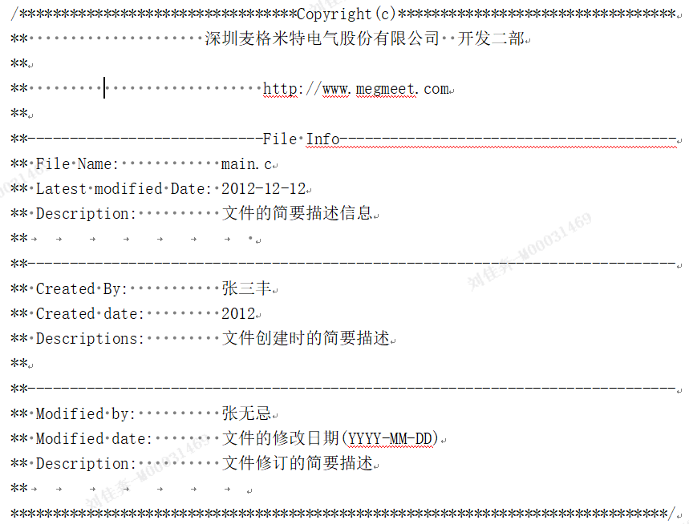

# 文件注释规范

1版权声明: 填写公司名称及公司部门，公司网站。

2文件相关信息：
(1)文件名。本源代码文件的完整文件名。
(2)最后修改日期。本源代码文件的最后更新日期。
(3)文件内容描述。描述本源代码文件的主要内容、主要实现的功能。

3创建本文件时的相关信息：
(1)创建者。创建本文件的作者姓名。
(2)创建日期。创建本文件时的日期。
(3)创建时文件的内容描述。创建本文件时，本文件的主要内容、主要实现的功能。

4修改者修改本文件时的相关信息：
(1)修改者。更新本文件的程序员姓名。
(2)修改日期。更新本文件时的日期。
(3)创建时文件内容描述。创建本文件时，本文件的主要内容、主要实现的功能。

