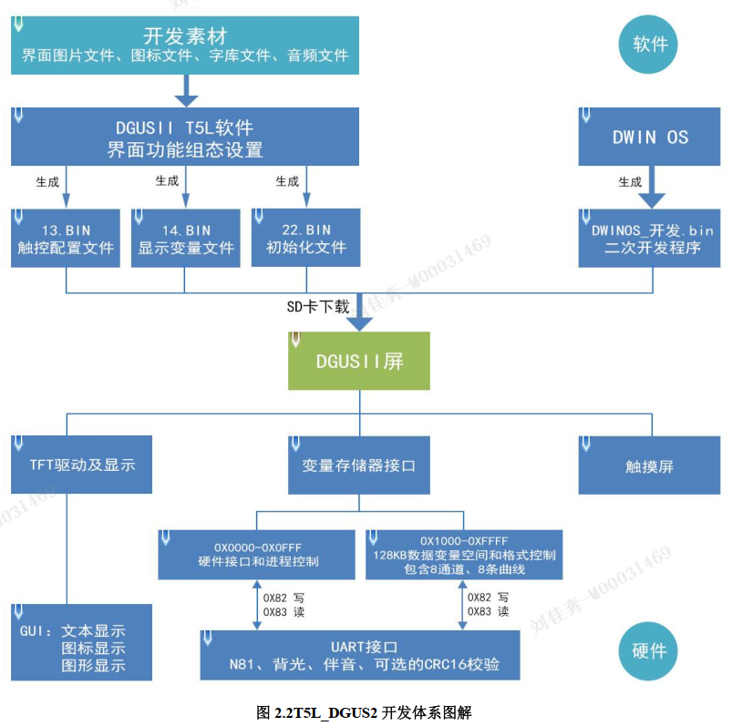
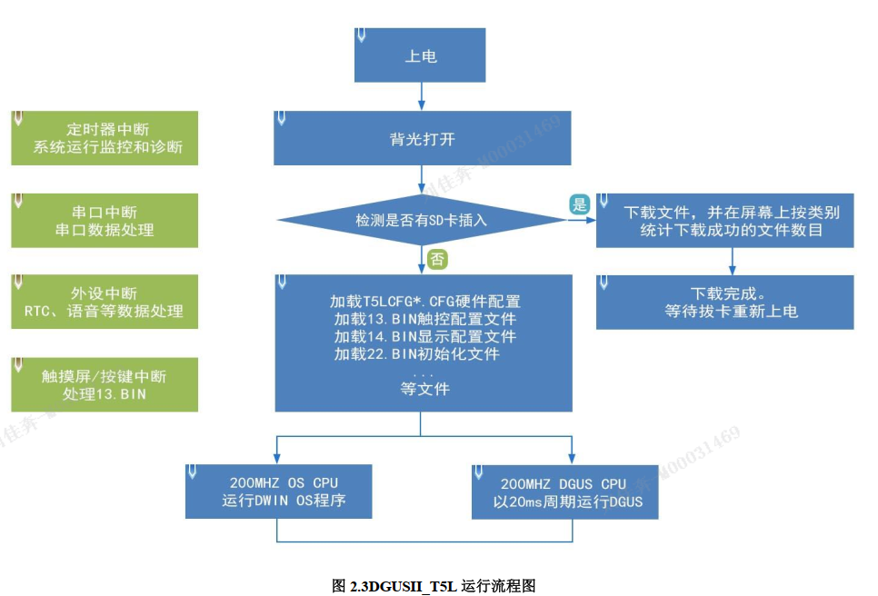
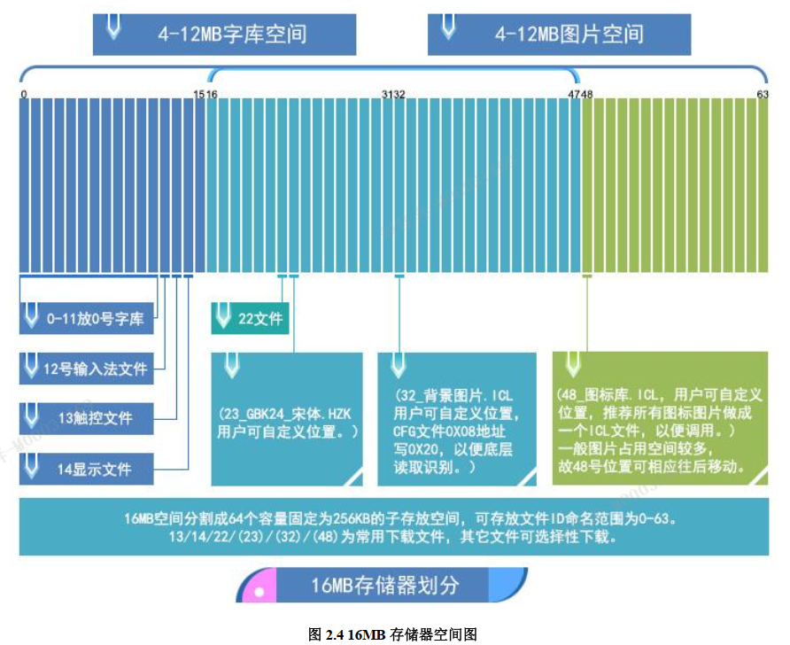
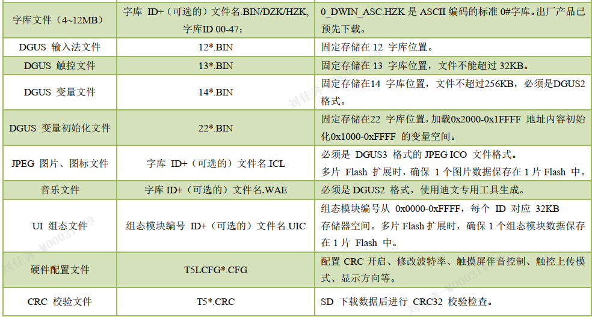
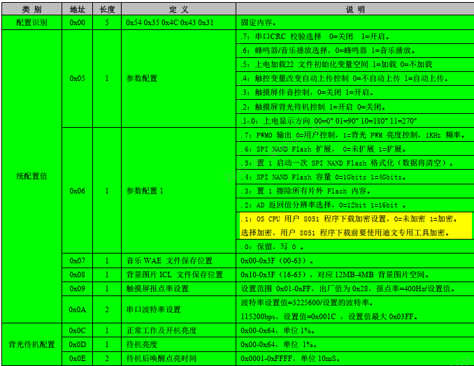

DGUS II
# 一
## 1 命名
型号：DMG10600T070_09WTRZ01
- DM:智能屏产品线
- G：16.7M色(24bit)
- 分辨率5位: 1024*600
- 分类T:工业级别
- 尺寸:7.0寸
- 属性:0基本类型
- 硬件版本:9
- 温度:W宽温
- 触摸屏:TR电阻
- 定制:Z01
- 扩展内存:(空)标准品

## 2 接线
引脚
- VCC
- TX4
- TX2
- RX4
- RX2
- GND

串口:
- 扩展串口,需要OS配置
- 串口2

TTL/RS232兼容:默认RS232
用户接口: 8Pin
FLASH:64MB
预留接口:WIFI, USB

## 3 电源
功率:< 5W
电压: 1-36V
电流: 120-330mA
推荐:12V,0.5A 直流稳压电源

## 4 驱动
USB-to-UART
- 两种芯片:
- XR21V1410 芯片和 CP2102 
波特率:
- 3150~3225600bps， 典型值： 115200bps

## 5 软件
1. 图片,分辨率与屏幕一致,BMP格式,24色,命名00
2. 对应版本的软件
3. +加载图片
4. 界面组态
   - 控键,变量录入
   - 属性
5. 保存,生成
   - 配置文件.bin,
6. 显示预览
7. 下载到SD卡

# 二

## 1 芯片
T5L系列:单芯片双核ASIC IC
- 8051核
- 独立GUI CPU核
- 单独OS CPU核
- 1Mbytes片内FLASH

## 2 DGUS II开发体系
1. 变量规划
   - 变量表格
2. 界面设计
3. 界面配置
    - 触控配置,显示配置,变量配置
4. 测试修改
5. 归档
   - 配置文件, 图片文件, 图标, 字库

## 3 特点
- DGUS刷新周期:20ms,读取13.bin,14.bin文件内容

## 4 软件流程
触摸操作:13.bin
变量,动画代号:14.bin

## 5 存储器分配
16MBytes Flash = 256KB*64
- 存储0-63号文件
  - 00-47: BIN, HZK, DZK
  - 16-63: ICL(图片/图标)

## 6 存储器变量地址空间
RAM 空间固定 128KB，分割为 0x0000-0xFFFF 子空间范围
- 每 1 个变量地址对应相应空间的 2 字节，每 1 个字节对应相应空间的 8 个位。
- 其中 0x0000-0x0FFF 是系统变量接口地址空间，用户不能自定义； 
- 0x1000-0xFFFF 变量存储空间用户可以任意使用。
- 如果 8 通道曲线同时使用， 
  - 0x1000-0x4FFF 将作为曲线缓冲区地址，此时该部分变量地址不能被其他控键使用，
  - 其他控键地址使用范围为： 0x5000-0xFFFF。

变量地址是 RAM 空间中储存某一个或多个变量的子空间的首地址，在该地址指向的空间中储存了显示变量的编码或状态变量的值。
- 通过发送指令和触摸屏录入都可修改变量地址中储存的数据。

## 7 描述指针空间
描述:显示变量的各项属性值,坐标,颜色,字体大小
描述指针: 描述 的地址
- 参考: **控键指令储存格式
- 发送指令修改

*SP: 描述地址
*VP: 变量地址

描述指针设置:
- 无曲线显示: 
  - 0X1000-0X7FFF 可以作为变量地址区间
  - 0X8000-0XFFFF 可以作为描述指针区间使用
  - 避免冲突
- 有曲线显示:
  - 0X1000-0X4FFF 将作为曲线缓冲区地址,不可更改
  - 0X5000-0X7FFF 可作为 VP 变量地址区间
  - 0X8000-0XFFFF 可作为 SP 描述指针区间
- 控键的复制

# 三
## SD卡格式
FAT32

## SD卡下载
液晶终端上电时，检测到插有 SD 卡，会识别 SD 卡根目录是否有 DWIN_SET 命名文件，如果 SD 卡中存在此文件命名，则液晶终端将文件里面相关符合格式要求文件内容拷贝下载到到 FLASH 中。 DWIN_SET 文件夹下的其他文件夹不能被正常读取。

## 下载文件说明
|文件类型|命名|说明|
|----|----|----|
|OS CPU 8051 程序|T5L51*.BIN|用户基于标准 8051 平台开发的应用程序|

下载文件必须放在 SD 卡根目录 DWIN_SET 文件夹中，并且必须是 4KB 扇区、 FAT32 格式的 SD 或 SDHC 卡。

**下载文件生成**
1. 背景图片库
   - 00_开机
   - .ICL格式
2. 图标库
   - 计算图标库占用空间
   - .ICL
3. 字库
   - DGUS 支持 BIN、 DZK、 HZK 这三种格式的字库文件
   - 字库编码: 8-bit， ASCII， GBK， GB2312， UNICODE
   - 0号字库,0号灰度字库,UNICODE 编码字库,
4. 初始化变量
   - 在CFG 文件 0x05.5 位配置 开启上电加载 22 文件初始化变量空间
   - 22_Config.bin
5. CFG
   - T5LCFG*.CFG
   - 硬件参数配置文件
   - 
6. CRC

.CFG文件配置

0x05:参数
0x06:参数
0x07:音乐文件
0x08:背景图片
0x09:报点率
0x0A-0B:波特率设置值=3225600/设置的波特率
- 0x1c=28=3225600/115200
0x0C-0E:开机亮度,待机亮度,唤醒时间(10ms)
0x10-0x1F: 显示屏(默认)
0x22 触摸屏灵敏度
0x27-0x2D: 蜂鸣器
0x2E:上电初始化变量ID配置
0x40:下载文件夹设置

