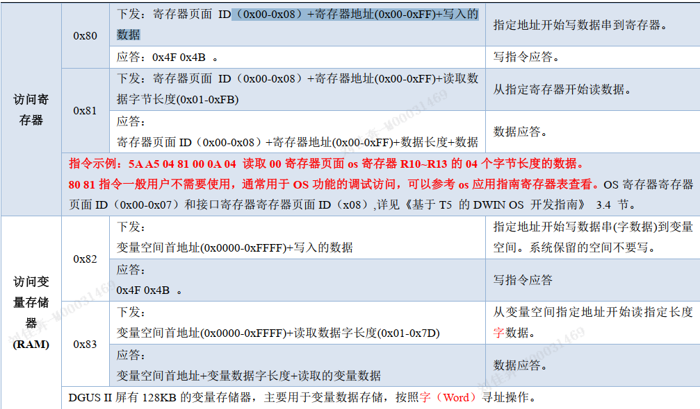

DGUS II
# 四 UART2串口
异步,全双工
数据:十位
- 1个起始,8个数据,1个停止
接线:
- 232/TTL 通讯和主板 T/R 输入输出信号交叉接线，地线必须接上.
- 485 通讯 485+接 A+，485-接 B-
串口所有数据或指令为16进制
高字节先传送MSB
一个DGUS周期传送数据不超过4KB

## 数据帧

串口模式为8N1,数据帧=5个数据块
- 帧头=2:0x 5A A5
- 数据长度=1:指令+数据+校验
- 指令=1:
  - 0x82写
  - 0x83读
- 数据:
- 校验(可选)

## 调试指令

寄存器页面有
- 00-07:数据寄存器
- 08:接口寄存器
- 每组256个

### 写变量存储器指令
帧头+数据长度+写指令+变量地址(xxxx)+数据(xxxx)+...
> a: 5A A5 05 82 1001 000A
> b: 5A A5 05 82 1002 000B
> c: 5A A5 07 82 1001 000A 000B

### 读变量存储器指令
读
帧头+数据长度+读指令+变量地址(xxxx)+读字长度(xx)
5A A5 04 83 1000 01
应答
帧头+数据长度+读指令+变量地址(xxxx)+读字长度(xx)+数据(xxxx)
5A A5 06 83 1000 01 0002

### 触摸按键返回到串口数据

5A A5 06 83 1001 01 0002
帧头+数据长度+读指令+变量地址(xxxx)+读字长度(xx)+键值(xxxx)
上传的协议格式：（按键返回地址 1001 键值 000A ）
5A A5 06 83 1001 01 000A

### 指令校验
。。。

# 五 系统变量接口
## 系统变量接口
系统变量地址范围:0x0000-0x0FFF
- 重启
- 更新
- 读写flash
- UART2_SET
- 软件版本号
- RTC
- 读当前页面ID
- ....
- 读写flash
- 开关文触控指令
- ...

## 网络接口
0x0400-...
