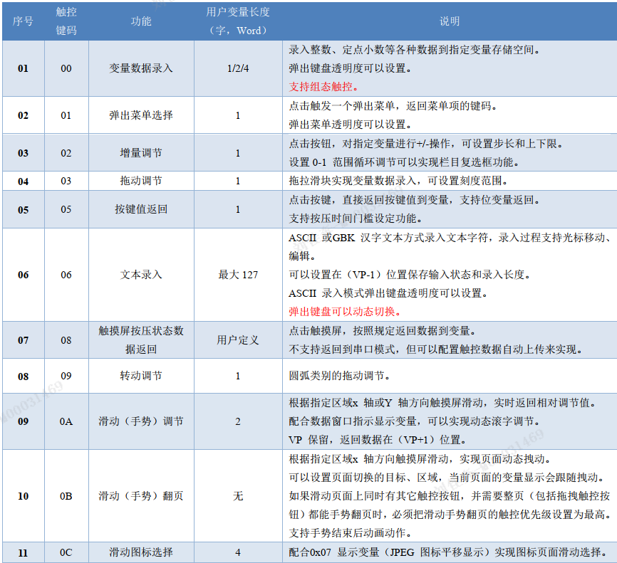

# 六 触控变量配置
- 13.bin文件中
- N条 触控变量指令组成
- 每条固定占用16,32,48 字节
- 一条指令=6部分
- 不超过256Kbytes

|name|length|描述|
|----|----|----|
|页面ID|2||
|触控区域|8||
|切换页面ID|2||
|按压效果ID|2||
|触控键码|2||
|触控功能|0/16/32|
## 触控功能表

# 七 显示变量配置
- 14.bin文件
- 存储在字库空间
- N条 页面变量指令
- 每条指令32字节
- 一条指令=6部分

- 文件最大2MB
- 每个页面分配2，4，8KB变量空间
- 每个变量32字节
- 最多1024张页面

## 变量功能表