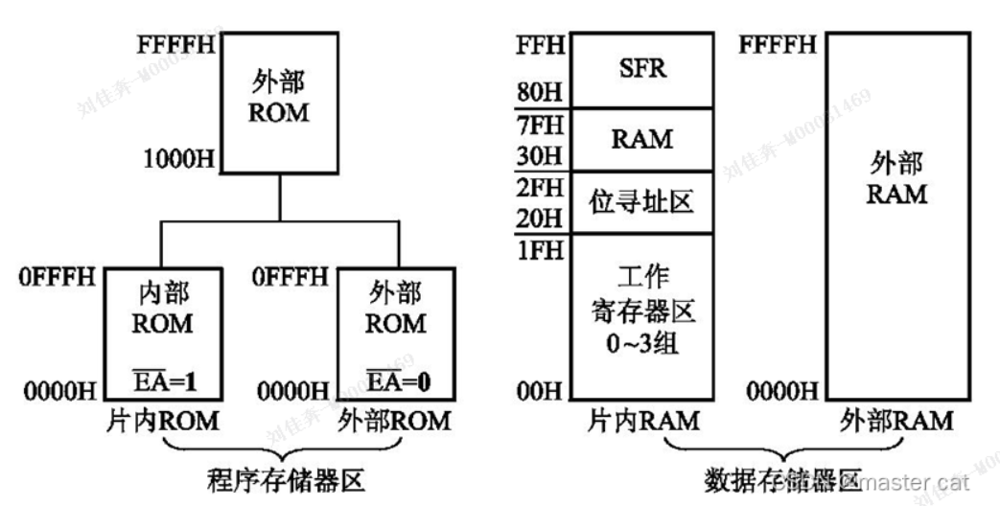
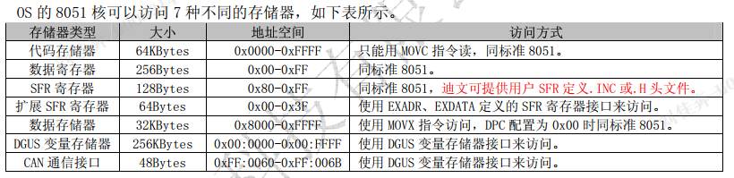

# 标准51
存储器三类：
- 片内存储
- 片外code
- 片外RAM

存储器四类：
- 程序存储器: (FLASH)
  - 片内4KB, 0000H-0FFFH,
  - 片外扩展 最大64KB, 0000H-FFFFH,
- 数据存储器: (256分：存储器和SFR)
  - 片内128B, 分段:   4寄存器*8B,   16B位寻址,    80B用户,    00H-7FH,
  - 片外扩展 最大64KB,
  - 使用相同地址空间,但是不同指令(不会冲突),
- SFR
  - 片内RAM的高128B,80H-FFH
  - 特殊寄存器
- 位地址
  - 211个=128+83
  - 128:RAM映射
  - 83:SFR

---

data:RAM的低128B
idata:RAM 的高128B
bdata:片内RAM,位寻址
xdata:扩展RAM,DPTR访问
pdata:扩展RAM低256B,分页寻址
code:程序

----
A51
idata_len  80H    //128B
xdata_start 4000H //16k

----
----
# DWIN_
产品：
- 64MB NOR FLASH

硬件
- T5L2
  - 1MBytes 片内 NOR Flash
    - 其中512KBytes 用于存储用户数据库
- FLASH:
  - 64MBytes NOR Flash， 存放字库、 图片、 音乐文件

芯片特点:
- CPU_DGUS II
  - 压缩图片/图标,大幅度缩小外置存储器到低成本的 16Mbytes SPI Flash
  - 128KBytes 变量存储器空间， 存储器接口和 OS CPU 核交换数据
- CPU_OS
  - 标准 8051 架构和指令集， 64Kbytes 代码空间， 32Kbytes 片内 RAM
  - 运算单元，IO接口
- 1Mbytes 片内 Flash， 迪文专利加密

# DWIN_OS
上电初始化寄存器:
...

OS的可访问存储器:

1. 代码 存储器
  - 64KB,SD卡/UART1/WIFI --> 1MBytes 片内FLASH-->上电-->加载到RAM
  - 地址,01:0000--01:FFFF
  - 指令读写
  - 分段:中断入口,仿真接口,程序代码
2. 数据 寄存器
  - 256B,00H-FFH,标准51,
3. SFR 寄存器
  - 128B,80H-FFH,标准51
4. 扩展SFR  (EXADR,EXDATA,寄存器接口访问)
  - 通过接口访问,00H-3FH,
  - 迪文扩展的,定义了数学运算单元的接口
5. 数据 存储器
  - T5L的OS核 有32KB RAM, 0x8000-0xFFFF, (低32KB不许用)
  - 指令访问
  - SFR寄存器
6. DGUS II变量存储器  (存储器接口访问)
   - 一个地址,**四个字节**
   - 0000-7FFFF,32K地址128KB字节,对应DGUSII的128KB变量存储器空间
   - 8000-FFFF,自定义使用
7. CAN通信接口  (接口寄存器访问)
   - FF:0060-FF:006B,**????????**
   - 48B

> 访问DGUS II 存储器使用SFR寄存器接口:
> RAMMODE,ADR_H:M:L,ADR_INC,DATA3:0