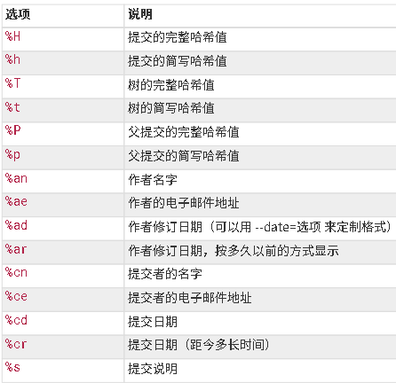
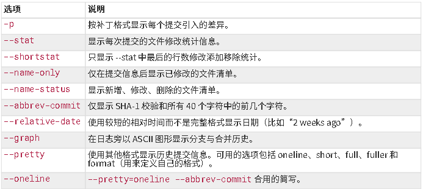

# hello-world
这是jia-ben的第一个存储库，Repository Name = hello-world.

# Git教程

## 1 开始
### 1.1 安装Git

安装windows上的git，检查安装结果
```
$ git -v
$ git --version
```

### 1.2 初始配置：
使用 `git config`来配置环境

> config 的配置变量有三个位置,分别使用
> ` git config --system`
> ` git config --global`
> ` git config --local`
> 来设置不同优先级的配置变量

配置作者名、邮箱地址、默认编辑器
```
$git config --global user.name jiaben
$git config --global user.email liujiaben@email.com
$git config --global core.editor "Path:name.exe" -Command

```
通过 `$ git config --list --show-origin` 查看完整配置。

### 1.3 帮助信息

使用help获取帮助手册
```
$ git help <verb>
$ git <verb> --help
$ man git-<verb>
```
或者使用`-h` 获取快速参考
` $ git add -h`

#### 补充：

> 命令行技巧：
> 命令行在分段输出长文本时，使用空格键继续，使用Q键返回到命令行。

## 2 Git基础操作

### 2.1 仓库

1. 在本地初始化一个仓库使用`git init`
2. 拷贝已经存在的仓库 `git clone <url>`
    > git clone 会复制仓库中的所有文件。
    >
    > clone 时更改本地仓库名: `$git clone <url> newname`

```
$ cd folder
$ git init

$ git clone https://github.com/jia-ben/hello-world mylib
```

#### 工作目录

**工作目录中**的文件是仓库的副本。
其中的文件分为
- 已跟踪
    - 未修改
    - 已修改
    - 已暂存
-  未跟踪 未跟踪文件不会被Git管控。

当在工作目录修改文件，对应文件被Git标记为 *已修改* ，你可以选择性地将**已修改**的文件放入**暂存区**，并 **提交** 所有已暂存的修改，循环往复。

使用 `git status` 检查工作目录中的文件状态。

```
$ git status
    On branch master
    Your branch is up-to-date with 'origin/master'.
    nothing to commit, working directory clean
```

### 2.2 add

`git add`指令可以：
- **跟踪**新文件
- 将**已修改**文件加入**暂存区**。
- 将合并时有冲突的文件 标记为**已解决**。

```
$ git add new_file
$ git add modified_file
$ git add conflict_file
```
#### 状态

status可以看工作目录的状态信息，使用`-s`简化该信息。
```
$ git status
$ git status -s
$ git status --short
```

####  忽略文件

有时候一些中间编译文件不需要被Git跟踪，通过创建一个名为`.gitignore`的文件，列出要忽略的文件的模式。
```
# 忽略所有的 .a 文件
*.a
# 但跟踪所有的 lib.a，即便你在前面忽略了 .a 文件
!lib.a
# 只忽略当前目录下的 TODO 文件，而不忽略 subdir/TODO
/TODO
# 忽略任何目录下名为 build 的文件夹
build/
# 忽略 doc/notes.txt，但不忽略 doc/server/arch.txt
doc/*.txt
# 忽略 doc/ 目录及其所有子目录下的 .pdf 文件
doc/**/*.pd
```
> .gitnore规范:
> 
> 所有空行或者以 # 开头的行都会被 Git 忽略。
> 
> 可以使用标准的 glob 模式匹配(shell使用的简化正则表达式)，它会递归地应用在整个工作区中。
> 
> 匹配模式可以以（/）开头防止递归。
> 
> 匹配模式可以以（/）结尾指定目录。
> 
> 要忽略指定模式以外的文件或目录，可以在模式前加上叹号（!）取反

> 若仓库有多个ignore文件
> 根目录下的.ignore文件递归到整个仓库，子目录下的.ignore只对子目录有效。

#### 查看修改

```
#查看工作目录的文件和暂存区的差异
$ git diff
#查看暂存区文件和最后一次提交的差异
$ git diff --staged
```

#### 提交修改

```
#使用add暂存要提交的修改
    $ git add file
#使用status检查暂存状态,确保需要提交的修改已经暂存
    $ git status
#使用commit提交,并启用编辑器编写说明
    $ git commit
#使用参数`-m`直接添加提交信息
    $ git commit -m "your description"
#此时你的暂存区内容已被记录
```
##### 不暂存就提交

使用`-a`参数在提交时自动暂存所有已修改文件.
```
#暂存并提交
    $ git commit -a -m "your description"
```

##### 移出文件

1. 删除文件需要将文件**取消跟踪**,并**提交**.
2. 使用`git rm file`来取消跟踪,并从工作目录删除.

1. 若从目录中**手动删除**文件,可以在`git status`中看到文件处于**未暂存**.
2. 使用`git rm file`移除文件
3. 下次提交便不在跟踪这个文件

1. 如果文件已经处于**暂存区**,则需要使用`-f`参数.

##### 移出但不删除

想让文件保留在磁盘，但是并不想让 Git 继续跟踪.使用`-cached`
> $ git rm --cached READ


##### 移动文件
Git 并不显式跟踪文件移动操作.如果在 Git 中重命名了某个文件,仓库中存储的元数
据并不会体现出这是一次改名操作.
既然如此，当你看到 Git 的 mv 命令时一定会困惑不已。 要在 Git 中对文件改名，可以这么做：
> $ git mv file_from file_to
>
相当于运行三条命令:
> $ mv README.md README
> 
> $ git rm README.md
> 
> $ git add READM

### 2.3 提交历史

#### log
使用`git log` 回顾提交历史:
```
 $ git log
    commit ca82a6dff817ec66f44342007202690a93763949  
    Author: Scott Chacon <schacon@gee-mail.com>
    Date:   Mon Mar 17 21:52:11 2008 -0700
 
        changed the version numb
 
 ......
 ```
不传入参数的情况下，`git log`会按时间列出所有提交记录.并且列出:校验和,作者,电子邮件,时间,提交说明.

#### --patch
使用`-p`显示提交引入的差异,也可以限制入日志数量.
> $ git log --patch -2
>
> 显示最近两次提交,并列出`diff`内容.

#### --stat
使用`--stat`查看简略信息.
> $ git log --stat
>
> #会显示出每次提交修改过的文件
>

#### --pretty
可以自动逸输出格式
> $ git log --pretty=online
> 
> $ git log --pretty=short,full,fuller
> 
> $ git log --pretty=format:"%h - %an, %ar : %s"





#### --graph

在使用`online`和`format`参数时,结合`--graph`可以使用制表符输出信息.

#### --since
使用`--since`和`--until`限制日志时间
> 最近两周的所有提交
> 
> $ git log --since=2.weeks

结合`--auther`和`--grep`进行模式匹配

#### -S
`-S`参数接收一个字符串参数,只显示涉及到该字符串修改的提交.

#### -path
???
> 日志中的合并提交往往没有用处,使用`--no-merges`屏蔽显示.

### 2.4 撤销

#### 撤销