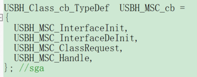

# IAP

## IAP 简介

简介

### 设置APP起始地址FLASH

- IROM1
  - START: 0x0801,0000
  - SIZE: 0x0070,0000
  - 因为FLASH的起始地址为0x0800,0000.大小为512K.64K为iap
  - 偏移量应当为0x200的倍数

### app起始地址SRAM

- IROM1
  - START: 0x2000,1000
  - SEZE: 0xC000(48K)
- IRAM1: 0x2000,D000 + 0x3000
  - 因为SRAM大小64K,0-4K:Bootloader. 48K:APP. 12K:app内存
  - 偏移量应当为0x200的倍数

### 中断向量表的偏移量设置

`SCB->VTOR = FLASH_BASE | VECT_TAB_OFFSET;`
VTOR寄存器存放向量表起始地址

### app程序

使用iap升级需要.bin文件,在keil/user配置

#### 总结

## 软件设计

1. 接收app程序
2. 存储到app代码位置
3. 运行app

# USB 串口

## 简介

 
 简介

USB-通用串行总线

- 四根线:
  - VCC GND D+  D-
  - 差分电压传输,
  - 主机:15K电阻拉低
  - 设备:1.5K电阻到VCC
    - 高速:D+,低速:D-,(设备识别)
- 控制器
  - PC与控制器公享一个专用的数据缓冲区
  - 缓冲区大小由 端点数目,每个端点最大数据分组 决定
  - 传输的格式由硬件完成
  - 缓冲区描述块:缓冲区的地址,大小,字节数
  - USB模块通过16位寄存器-->缓冲区
- 中断映射
  - 三个不同的NVIC线
  - 1.低优先级20： 所有USB正确事件
  - 2. 高优先级19：同步、双缓冲批量传输 正确事件
  - 3.唤醒42： 唤醒事件

# USB

[USB外设说明](https://wiki.stmicroelectronics.cn/stm32mcu/wiki/Introduction_to_USB_with_STM32)

# USB升级过程

## USBH_Process（）

swtich phost->gState
状态机：

- HOST_IDLE
  - 操作：ResetPort()
  - 切换状态机->HOST_IDLE
- HOST_WAIT_PRT_ENABLED
  - 判断端口使能，切换状态机
- HOST_DEV_ATTACHED
  - 调用 usr_cb-> DeviceAttached()
  - 判断重置端口==0：
  - usr_cb->ResetDevice()
  - 打开通道chaannel
  - 切换状态机
- HOST_ENUMERATION
  - 进行枚举()，返回ok
  - 结束枚举()
  - 切换状态机
- HOST_USR_INPUT
  - usr_cb->UserInput()，返回ok
  - class_cb->Init()
  - 切换状态
- HOST_CLASS_REQUEST
  - class_cb->Requests()
  - 返回ok切换
  - 返回错误->错误处理USBH_ErrorHandle()
  - >错误处理:根据错误号,执行操作,并切换到状态机到error
- HOST_CLASS
  - class_cb->Machine()
  - 错误处理USBH_ErrorHandle()

## USBH_MSC_Handle()

状态机:.MSCState

---
