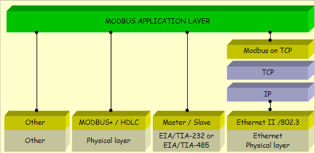
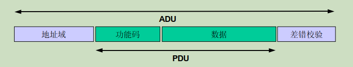
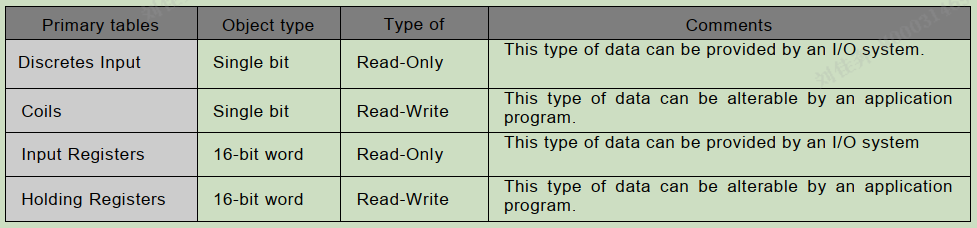
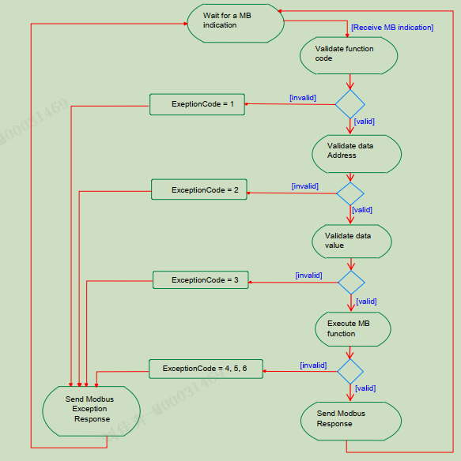

# modbus

## 1.介绍

MODBUS是一种请求/应答协议,提供功能码指定的服务.功能码是请求/应答PDU的组成元素.
MODBUS是一种应用层消息传递协议,连接不同类型总线或网络设备.
介质:

- TCP/IP
- 异步传输(232/485/光纤/无线电)
- MODBUS PLUS

## 2.描述

MODBUS定义了独立于底层的协议数据单元PDU,应用数据单元ADU.

### 通讯流程

MODBUS事务：

- 客户机启动请求<功能码+数据请求>
- 服务器执行操作,启动响应<操作码+数据响应>
- 服务器检测差错<差错码+异常码>
- 客户机接收响应

### PDU

1. 请求
   req={function_code,req_data}(1Byte功能码+n)
1. 响应
   rsp={function_code,rsp_ data}(1Byte功能码+n)
1. 异常
   excep_rsp={function_code+0x80,rsp_ data}(1Byte功能码+1Byte异常码)

注:数据域与功能码相关

### 编码

大端:0X1234,先发送0x12,在发送0x34.

### **数据类型**

### 事务处理

## 3.功能码

### 3.1 0x01读线圈
req: 1功能码 + 2起始地址 + 2线圈数量
rsp: 1功能码 + 1字节数 + n线圈值
## 4.功能
