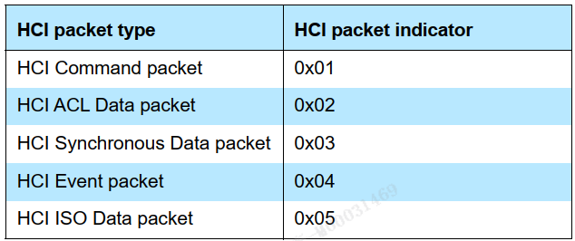
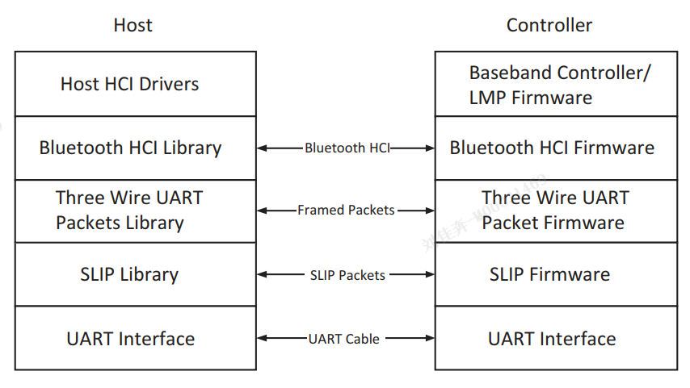
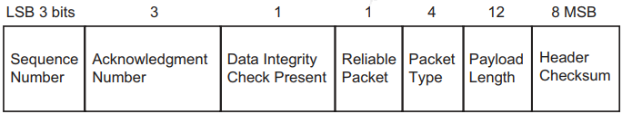
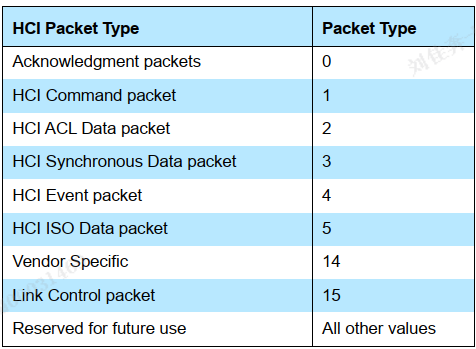
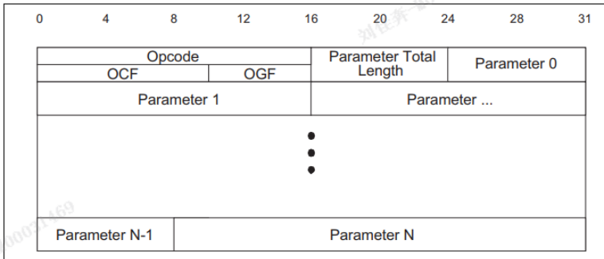
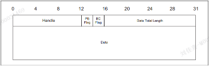
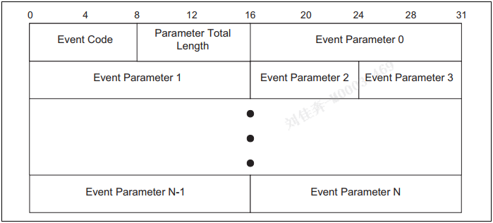

# HCI

## UART

UART有五种包:

- command: 单向发给控制器
- event:  单向控制器发送
- ACL/Sys/ISO: 控制器可以收发

> 在发送HCI包的时候,应当在他之前发送 [HCI packet indicators]

五种包中,都有长度段,说明字节数.

### 232设置

波特率: 厂商指定  
数据位: 8  
校验位: 无  
停止位: 1  
流控制: RTS/CTS(用于UART缓存器发送控制)(1允许,0禁止)  
流控制的响应时间: 厂商指定  

### 错误恢复

- 错误:同步丢失  
- 原因:错误的HCI/包长度超范围  
- 涉及内容:[错误事件],[reaet指令],[complete事件]  
- 恢复过程:

  - 控制器发送ERROR事件,上报错误
  - 主机发送reset指令
  - 控制器发送complete事件
  - 主机扫描complete事件

## 3-UART

三线UART考虑了传输时,可能会发生位错误,溢出错误,突发错误.  
过程:  

- 添加**头**
  - 头-描述包内容(e: 重传的包)
- 使用 **SLIP** 封装帧
  - SLIP-将字节流转换为包流
  - 放置开始和结束字节
  - 将包中所有帧开始字节结束字节->转义符
- UART **发送**

### SLIP

SLIP-为每个数据包添加字节,用于丢失检测,遵循标准 RFC 1055

#### SLIP编码

对于每个字节,添加字节编码.

过程:

- 首尾添加 0xC0
- 遇到0xC0，替换为0xDB,0xDC
- 0xDB替换为0xDB,0xDD

#### SLIP解码

过程:

- 未知状态：寻找0xC0，如果找到连续两个，丢弃第一个。
- 解码状态：将转义字符，还原原始字符
- 寻找开始C0和结束C0，统计数据包长度
- 交给解码器
- 找下一个包

### 数据头

一个包：4字节头，4095字节有效载荷，2字节完整性检查(option)

头:

- 3位的序列号
- 3位的确认序号
- 1位完整性检查
- 1位可靠数据包
- 4位包类型
- 12位有效载荷长度
- 8位包头Checksum
- 

#### 序列号

对于不可靠数据包,这个区段 = 0

每个可靠数据包,都分配序列号,规则:  
前一个序列号加1模8.
*重传使用相同序列号*

#### 确认号

设备期望接受的下一个可靠数据包序列号.

#### 完整性检查

数据包结尾的16位检查字节

#### 包类型

三线UART有五种包类型:  

五个包是可靠的-开启了SynchronousFlowControl  
否则HCISyn包不可靠.

附加的:Ack-单纯的确认  
Link-链路控制
Vendor-供应商自定义
Res-保留

#### 校验位

计算: 默认为0xFF,计算补码和,对256取模

## HCI功能规范

### HCI包格式

基本要求:  
所有值都是二进制和十六进制.  
命令包和事件包的参数顺序与HCI命令与HCI事件中的参数顺序相同.  
数组的格式为ParameterA[i].  

HCI命令和HCI事件有两个标识符:  
IDs,用于对端设备.  
handles,用于区分主机-控制器的逻辑通道.(Connection_Handles,Sync_Handles, Advertising_Handles, and BIG_Handles)  

**命令包**  
  
每个指令有Opcode,高6位为OGF,OCF为剩下10位.  
Parameter_Total_Length: 包含所有的参数的字节长度，最大255字节.  
Parameter 0 - N: 参数列表与指令类型相对应,每个参数都是字节倍数.  

**ACL数据包**  
  
四个字节的包头.  
Handle...  
Packet_Boundary_Flag:包头第二个字节的4 5 位.  
Broadcast_Flag: 包头第二个字节的6 7 位.  
length: data的字节长度.  
data：数据内容。27字节？

**事件包**  
  
EventCode:一个字节,区分事件类型.  
length: 参数的字节长度.  
parameter: 与事件类型关联. 255字节.  

## 支持的HCI指令和事件

低功耗的HCI包内容与经典有不同。

指令完成事件、指令状态事件、数据缓存溢出事件、断开连接指令C3、断开完成事件C3、加密变更事件、读波特率指令、硬件错误e、主机缓存大小指令c107、接收CIS请求指令C40、添加设备到过滤器指令、广播报告事件c98、信道加密算法事件c23、创建连接完成、创建连接指令、加密指令、读取本地设备的一些信息...  

创建连接：扫描间隙、扫描窗口、过滤原则、对端设备地址、类型、自身类型、连接间隙maxmin、外设延迟、监督超时、CE长度  
