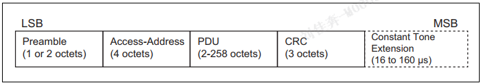
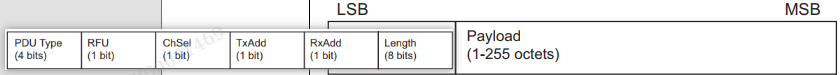
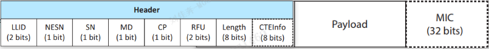
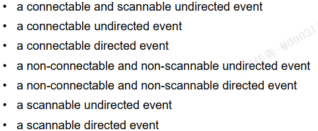

# 链路层LL

## 1概述

### 1.1状态机

状态类型:
...

一个状态机同时只能在一种状态，状态机可以支持不同的状态组合(规范1.1)，要求至少有一个状态机可以进入广播或扫描，可以有多个状态机。

描述:
...

### 1.2位流

链路层的数据包遵循:LSB小端格式,b0最先发送.  
多字节区域:CRC/MIC,先发送最低有效字节.  
除了CRC:所有多字节区域的单字节,应当LSB顺序发送.  
CRC例外.

### 1.3设备地址

公共地址,随机地址,都是48位,  
公共地址由.IEEE标准.创建.每个蓝牙设备有唯一的BD_ADDR.  
随机地址:最高两位决定子类型:不可/可解析私有地址,静态地址,保留.

### 1.4信道

40个射频信道->两组:广播信道+通用信道

## 2空口包

两种PHYs:编码数据包,未编码数据包  
未编码PHY包组成:前导序列+接入地址+PDU+CRC+CTE(可选)  
编码PHY:前导序列+接入地址+CI+TERM1+PDU+...  
PDU有:广播PDU,数据PDU...  

### 2.1 LE UNCODE PHY

未编码PHY包组成:前导序列+接入地址+PDU+CRC+CTE(可选)  
不带扩展传输时间:44-2128us.  

前导码:作用用于频率同步,时序计算,增益训练?  
内容: 0/1交替的序列.01010101/10101010  
长度:1M PHY为1字节,2M PHY 为2字节.  

接入地址作用:每一个连接,不同的接入地址.  
内容:不同的PDU有不同要求.除部分PDU,其他广播通道的接入地址是固定值0x8E89BED6..  

PDU:在广播通道或周期通道或二级广播通道传输的包-广播物理信道PDU,数据通道传输-数据物理信道PDU,同步通道-同步物理信道PDU  

CRC:由PDU内容计算  

### 2.2 LE CODE PHY

略..

*补充*:连接状态提到,不同方向,可能使用不同的coding.  

### 2.3 广播/周期物理信道PDU

组成:16位头+255字节有效载荷  
PDU类型:广播/周期信道的PDU类型见规范.  
ChSel+TXAdd+RxAdd:PDU类型不同,含义不同.  
lenth:PDU有效在载荷的字节数1-255.  
有效载荷:PDU类型不同,有效载荷格式不同.  

PDUs

- 广播PDU-10
  - AdvA+AdvData/AdvA+TargetA/通用扩展
- 扫描PDU-4
  - ScanA+AdvA/AdvA_ScanRspData/通用扩展
- 发起PDU-3
  - InitA+AdvA+*LLData*/通用扩展
- 通用广播有效载荷
![通用扩展广播Payload]](image-25.png)  
有效载荷类型：广播、扫描、发起。  

### 2.4 数据信道PDU

LLID:指示PDU类型-LLControl/LLData PDU  
NESN:下一个期望序列号  
SN:序列号  
MD:more  
CP:CTE恒音扩展?  
length:有效载荷+MIC 的字节数  
CTEInfo:Constant Tone Extension信息  
MIC:部分PDU没有,计算得到.  
有效载荷:LL指定,其中控制PDU有更多子类型.

## 3位流控制

包括:错误检查,白化,编码.  

## 4 空口协议

### 帧间间隔

T_IFS(连续数据包):上一个数据包最后一位->下一个数据包第一位间隔-150us  
T_MAFS:AUXPtr数据包与它的辅助数据包的最小间隔-300us
T-MSS:子事件最后一包最后一位-子事件第一包第一位最小间隔-150us

### 时钟要求

时钟分为主动时钟+睡眠时钟.  
时钟用于两个特定事件之间和设备发送数据包.  
主动时钟精度误差小于50ppm,睡眠时钟误差小于500ppm  

### 设备过滤

设备过滤减少响应设备数量,不同的状态机,使用不同的过滤策略.

有一个设备过滤列表,重置时候为空,由主机配置,然后自动运行.所有过滤策略的列表相同.

### 未连接状态

standby:不许收发,可以进入广播/扫描/发起/(同步/同步广播)  

**广播状态**  
广播状态功能:在主机指示下进入,在 *广播事件*/*周期事件* 发布广播PDUs.  
  
*广播事件*: 广播事件由广播信道索引上的一个或者多个PDU组成.发送完成PDU后,广播事件结束.  
在一个广播事件中所使用的广播信道索引上发送最多**一个**广播PDU.(一般的,在每个广播信道发送一个PDU).  
*广播事件* 有多种类型,大类可以分为: 可连接事件+不可连接事件+可扫描事件+不可扫描事件.不同的广播事件使用不同的PDU,允许不同的响应.  
*广播信道索引选择*:二级广播信道索引由AuxPtr字段指定,其他由 信道选择算法#2计算.

**扫描状态**  
扫描状态功能:在主机指示下进入,扫描时,链路层听通用广播信道的PDU,并且在主机指示的PHYs(1M/2M/Coded)上.有两个分类:主动扫描+被动扫描.  
没有严格的时序和信道选择规则.  
*扫描窗口*:按照主机要求,在每个扫描窗口侦听不同的索引,除非调度冲突.
*扫描间隔*:一个扫描开始->下一个扫描开始.扫描窗口≤扫描间隔<40.96s.  
如果收到了带AuxPtr的PDU,且支持它指向的的二级PDU,尝试接收它的从属集,并应用 *窗口扩大* 规范.如果不支持它指向的二级PDU,不侦听.

**发起状态**  
发起状态功能:在主机指示下进入,应当侦听通用广播信道.  
没有严格的时序和信道选择规则.  
应当发出连接请求给可连接的广告.可以在通用/二级广播信道.  
在通用广播信道发送了连接请求PDU后,退出 *发起状态*,作为中心设备进入 *连接状态*  
在二级广播信道发送了连接请求后,需要等待响应PDU.收到则连接,未收到则使用后退算法.

### 连接状态

进入条件:  
完成连接请求的收发(通用广播信道)  
完成连接回应的收发(二级广播信道)  
此时,一个连接被创建,但是直到收到一个数据信道的数据包,一个连接被建立.  
创建的连接使用1MPHY/已使用的PHY,(通用信道/二级信道)  

*连接事件*  
链路层在 *连接事件* 传送 *数据信道PDU*.双方决定每一个连接事件的索引,同一个连接事件使用相同的索引.  
连接事件期间:两个设备交替发送包  
双方都有一个16位连接事件计数器,在每一个连接事件+1.(用于同步链路层控制过程)  
> 连接事件中,中心设备至少发送一个PDU,可能因为一些因素发送失败?,但是应当在监督超时前发送一次.

*连接参数*  
连接时间的时间参数:*连接间隔*+子基准事件+子因素+连续数+*外设延迟*(从机潜伏?)  

*连接事件的关闭*  
在数据信道PDU的头中由MD位,指示是否有更多包发送.都没有就关闭.

> 初次建立连接的参数,部分是默认,部分在连接请求PDU中.通过特定PDU可以更改连接参数.

## 链路层控制协议LLCP

LLCP用来控制和协商两个链路层对 *连接* 的操作,包括 连接控制/加密的启动停止/其他 的过程.  
同一时间,每个设备的每个连接只能发起一个 *链路控制过程*.  
同一设备同一连接的上一个过程结束前,不能发起新的过程.  
除非禁止,在响应对等设备发起的过程时,may? 发起一个过程.

## end

> 链路层定义两种帧包格式.  
> 链路层之间通过链路通信,有接入地址等参数,
> 链路层根据状态机运行,空闲状态/广播状态/扫描状态/发起状态/连接状态等.  
> 不同状态,工作方式不同,发送/接收/响应的PDU都有不同流程.  
> 广播状态下,有多种事件(events),每种事件使用不同的PDU组合.或者说,发送的不同PDU组合构成了不同事件.
>
> 物理信道,频率与时间参数的结合.  
> 物理链路,两个设备之间的连接,与物理信道相关联.物理信道支持多个物理链路,使用接入地址.  
> 逻辑传输类型,支持不同的逻辑链路类型.ACL+ADVB+...  
> 逻辑链路,支持不同应用程序数据.ACL_C+ACL_U+...  
> 逻辑链路供L2CAP使用。
> 
