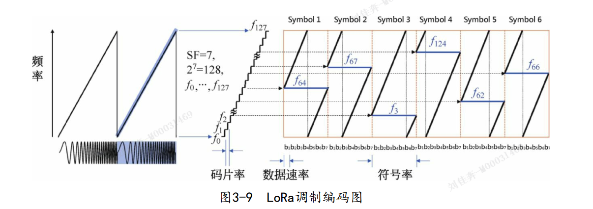
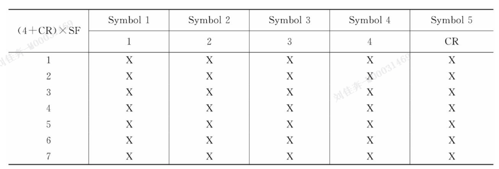
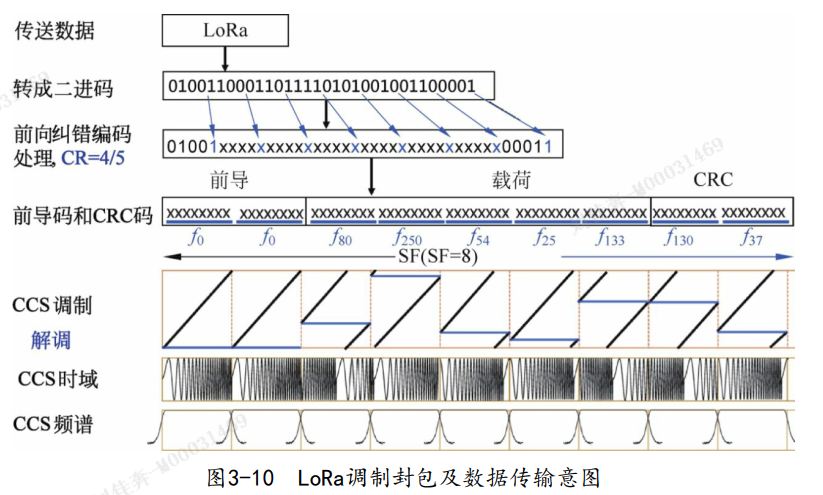

# 通信协议

物联网通信

- 短距离：Zigbee、WiFi、蓝牙、Z-wave
- 广域网LPWAN:
  - 未授权频谱：LoRa、SigFox
  - 授权频谱：EC-GSM、LTE Cat-m、NB-IoT

## 物联网

### 系统分层

1. 感知层
   > 采集信息，物联网无线终端
   > 相关无线协议:LoRa,RFID、蓝牙、ZigeBee、WiFi
   > MCU,MEMS
2. 网络层
   > 传输信息:有线/无线
3. 平台层
   > 承上启下
   > 连接管理,设备管理,应用使能,业务分析.
4. 应用层
   > 处理信息

## LORA

### what

LoRa技术特点：具有远距离、低功耗（电池寿命长）、多节点、低成本。

安全:AES128加密

工作频段:433,868,915

调制方式:私有专利扩频技术
> 基于 **线性调制扩频**,具有**前向纠错**

### 架构

属于无线接入技术:应用于 无线终端,网络传输层

- 终端:采集信息
- 基站:连接到服务器
- WAN服务器:管理基站

### 终端连接

- 点对点
  > 频点分开
- 星状网,轮询
  > 循环一对一
- 星状网并发
  > 网关接收

### 终端工作模式

A B C三类设备

1. 长期休眠
2. 间隙性休眠
3. 实时在线

## LoRa 帧结构

数据包 = Preamble + Header + Paylod + CRC

前导序列

> 使接收器与传入数据流同步,长度可调.
> 未经调制的码元+特殊结束标记
> 未调制码元至少6个码元+4.25码元 结束标记

头

> 显性头/隐性头(以最大编码率传输)
> 20位
> 有效负载长度
> 前向纠错码率
> 有效载荷的CRC选择
> 报头CRC

有效负载

> 用户需要的数据,可调长度

有效载荷CRC

> 根据需要配置,16位

## 调制技术

分类:模拟,数字,脉冲,扩频

模拟调制:

- 振幅AM,频率FM,相位PM.

数字调制:

- 单载波调制
  - 幅移键控ASK
  - 频移键控FSK
  - 偏移四进制相移键控O-QPSK
- 多载波调制
  - 正交频分复用OFDM

### 扩频调制

信号频带更宽,基本过程:

- 基带信息
- 扩频码
- 宽带信息
- 恢复

扩频分类:

- 直接扩频
- 跳变扩频
- 时间跳变扩频
- 宽带线性调频
- 混合

DSSS使用:相互正交的PN码,与发送数据相乘,得到扩频信号

FHSS使用:扩频序列使载波频率跳变

THSS使用:序列码控制发送信号的时间

**chirp**(宽带线性调频)使用:发射周期内,载波频率线性变化

### chirp(线性调频)

线性调频不使用PN码

一般形式:

- 二元正交键控:上升信号,下降信号
- 直接调制:chirp的展开过程

## LORA 调制

利用：Chirp变化的速率--扩频因子

扩频因子越大--距离越远--数据速率降低--更长的码片表示一个码元

2^SF的码片表示SF位的信息量

- 在一个码元周期,从某个 **初始** 频率上升
- 到最高频率后,继续从最低频率上升

### 1纠错

有效载荷进入纠错编码->为其添加纠错码

过程:将有效载荷 **4字一组** ,按照CR配置,构造 **4+CR** 比特段.

### 2交织器

定义:改变 **信息结构** 而不改变 **信息内容**

过程: 交织器为 (4+CR) * SF 阵列,将内容编码到4+CR个码元上,每个码元SF位.

### 3扩频序列发生器

提供未经调制的前导码,输出一个具有恒定包络的复杂采样流.

### 4坐标转换,delt-sigma调制

处理采样流,并发射LoRa信号.

## LoRa 解调

LoRa核心专利

## LoRa 芯片

两个:射频芯片,网关芯片(大吞吐量,强计算能力)
