# host

## L2CAP

### 特性

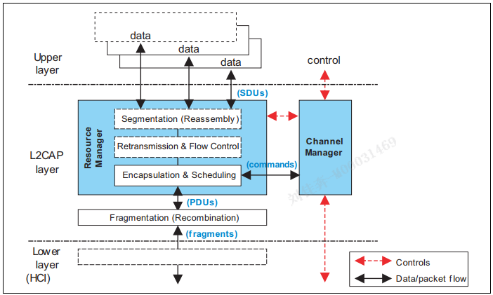

主要功能：  

**协议/通道复用**  
区分多个上层实体  
控制器只有一个  
通道连接到正确的上层协议  

**分段重组**  
让L2CAP控制PDU的长度  

- 分段,允许应用数据的交错,以满足延迟
- 存储和缓存管理 更容易
- 纠错重发更高效
- 降低出错的影响
- 应用程序和底层数据解耦

**单通道流量控制**  
控制器控制空中数据包流量  
HCI控制HCI流量  
当有不同的L2CAP通道,需要单独的流量控制  

**错误控制和重传**  
控制器的错误率高,由L2CAP降低.  
L2CAP纠错 通过了控制器纠错的错误包.  
L2CAP纠错 防止控制器刷新丢失包.  
与流量控制相辅相成.

**支持流式**  
某些应用使用流式传输.  

**破碎重组**  
L2CAP下发�oHCI的包可能被再次分段.  
L2CAP对HCI和控制器上传的分割的包,进行重组.  

**保证服务质量**  
???

### 协议假设

1. 控制器提供有序数据包传递.两个设备间最多一个ACL-U逻辑链路/LE-U逻辑链路.
2. 控制器是双工通信,但是不是对所有业务提供双向通信.
3. L2CAP提供了一个具有可靠度的通道.使用额外的检测 重传.
4. 控制器和HCI都有流控制和错误检查.有的应用需要更好的.有四种模式:增强的重传,重传,流控制,流模式.

### 名词

PDU:协议数据单元(Protocol Data Unit):包含L2CAP协议信息字段、控制信息和/或上层信息数据的数据包.
PDU总是由一个基本的L2CAP头开始。PDU有多种类型B,I,S,C,G,K  
基本L2CAP头:出现在PDU开始的最小协议信息:PDU长度,CID信道识别符.  
SDU:L2CAP和上层交换的数据包.在L2CAP通道传输的数据包.  
有效载荷大小:一个PDU中SDU的字节数.  

**CID**  
L2CAP的每个端点及其通道,都有一个CID.  
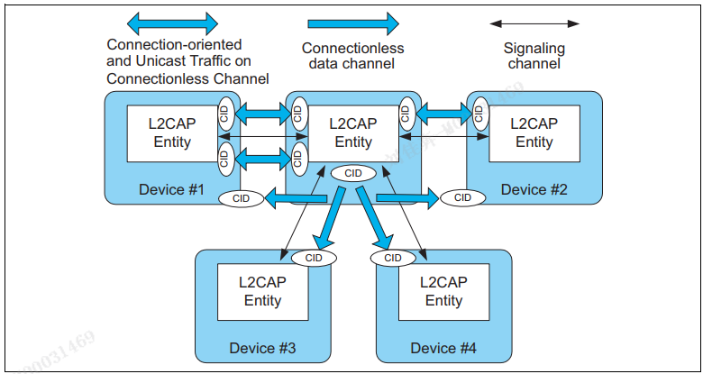  
> CID会映射到逻辑链路,来自不同设备的相同CID,也可以被区分.来自相同设备的相同CID也可以区分.  
> 同一链路上的两个L2CAP通道要使用不同的CID.  
> 对于LE-U链路,CID4 5 6对应属性协议/信令通道/安全协议.  

**模式**  
L2CAP通道在不同的模式下工作:基本模式,流量控制...  

**层与层的操作**  
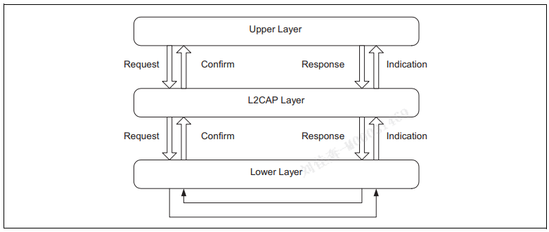  

**通道-映射-逻辑链路**  
L2CAP通道映射到逻辑链路,逻辑链路工作在物理链路.  
LE-U逻辑链路工作在LE物理链路.  

### 数据包格式

基本模式下,面向连接的通道使用的PDU: B-frame  
length:指定有效载荷大小最大65535字节,用于接收端重组和检查完整性.  
CID:L2CAP通道标识符.  
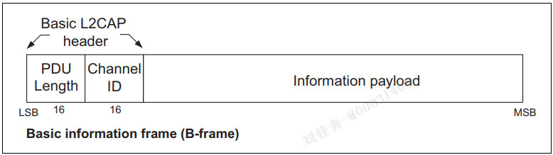

基本模式,无连接的通道,G-frame:  
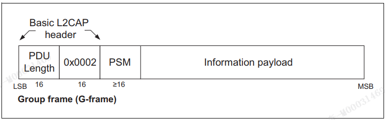
PSM: 协议复用器.  

信令包格式,在信令信道传输,用于对端设备交换信令指令.  
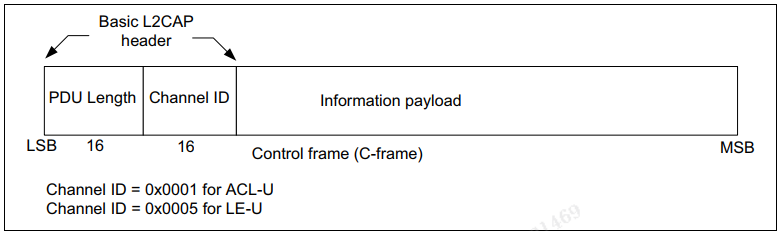  

### 状态机?

根据L2CAP通道的工作状态,分为几个大类:CLOSED,WAIT_CONNECT,WAIT...,CONFIG,OPEN,WAIT_DISCONN...  
这些状态机不一定适合所有场景.  
状态的切换由事件和行为驱动.  

### 一般过程

L2CAP的一些操作:配置过程,用户数据处理,用户数据处理  
特性的一些操作:错误包传递,过期数据包刷新,非连接操作...等  
通道的参数包括:MTU,刷新时间,服务质量,检查序列...等  

过程:配置通道参数,

### L2CAP总结

> 提供协议复用功能,供应用程序使用逻辑链路(ACL_U).  
> 应用程序通过L2CAP通道,与对端应用程序交换SDU数据包.  
> L2CAP通道使用CID区分.  

## GAP

*蓝牙协议profiles*:协议在蓝牙核心规范之外,定义各个层需要的功能和特性.  
*GAP* 是所有蓝牙设备都需要支持的协议,为不同厂商的蓝牙设备提供互通.其他协议为GAP的超集.  
侧重描述蓝牙设备的待机/建立连接的行为.  
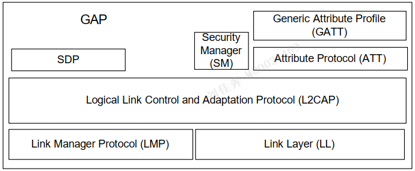  

内容:  
定义四个GAP角色:...  
定义几个模式(用于LE物理传输):广播,发现,连接,绑定...  
安全方面:...  
定义了用户界面相关:蓝牙地址,设备名称,蓝牙PIN,设备类型,外部特征,配对(SMP服务)  

## ATT

ATT协议功能:服务器向客户端提供一组属性数值,客户端可以读写和访问该值,客户机可以指示和通知该值.

一个ATT属性的构成:  
属性类型(UUID-type)：128位UUID，  
属性句柄(handler)：16位，服务器为自己的属性分配的唯一标识,用于客户端索引.属性句柄可以被上层用来分组,将某些句柄值分为一组.  
属性值value:固定或可变长度的字节数组.  
一组权限(permission):访问权限,加密权限,授权,身份认证,的组合  
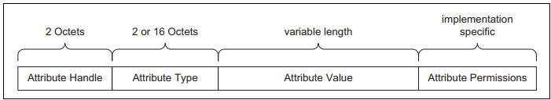  

## GATT

GATT建立在ATT的基础上,为ATT值提供操作和框架.  
GATT将ATT协议使用的ATT属性格式化,称为 *服务* (services)和 *特征* (characteristics).  
服务=一组特征,特征=一个值+任意个描述符.  
服务:GATT包含GAP文件定义的所有服务.  

特征:  
设备名称特征:0-248字节的设备名特征.可读(无需授权/验证)  
外观特征:2字节外观特征(图标/字符串).可读(无需授权/验证)  
PPCP特征:外围设备首选连接参数,一个,8字节.
中心设备地址解析特征:告诉客户端是否支持地址解析.1字节.  

GATT定义的过程包括:特征的发现,读,写,通知,指示.  
这些协议过程的基础:ATT的承载者-L2CAP通道  
GATT传输ATT数据的格式:commands, requests, responses, indications, notifications and confirmations.  
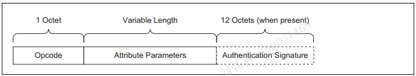  
  

## 补充

### ATT PDU

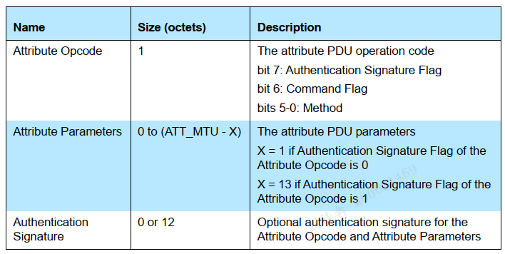

NTF: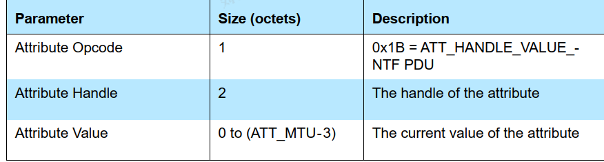
## end

物理层:  
蓝牙使用40个1Mhz信道.自适应跳频技术.调制方案