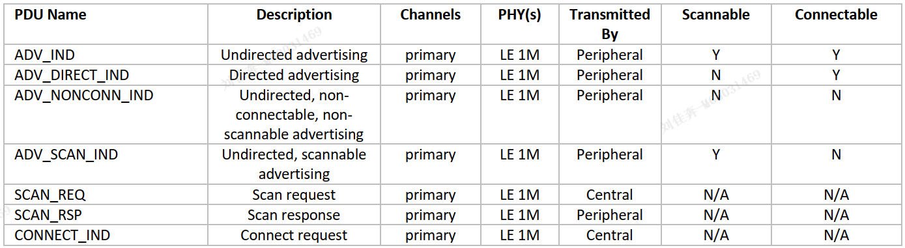

# 蓝牙 LE

## 1蓝牙背景

2000年便有,用于两个设备直接交换数据

广泛用于音频

Bluetooth BR
> 第一代蓝牙,物理层速率: 1 mb/s

Bluetooth BR/EDR
> 更快的蓝牙,物理层速率: 2 mb/s

Bluetooth Low Energy (LE)
> 全新蓝牙技术4.0
> 支持 **一对一通信** 和 **广播模式**
> 这是 **蓝牙网络** 的基础

*设计目的*: 提高供电效率,采用不对称设计-电量充足的设备承担更多任务

## 2蓝牙规范

配置文件:针对具体设备和应用的蓝牙技术规则。

服务:提供设备相关的状态数据，并提供数据的操作。

**蓝牙核心规范**: 定义堆栈，协议，过程。定义堆栈的行为和功能。

## 3蓝牙LE 栈

蓝牙栈相当于跨越了所有OSI层。

The Host Controller Interface(主机控制器接口):声明 **逻辑接口**

各层概览：
|层|定义|
|----|----|
|物理层physical|定义RF相关内容:调制,频带,信道,收发器特性|
|连接层link|定义空中数据包格式,位流,状态机,链路控制|
|ISOAL|同步设备使用不同的帧时常,对封装/未封装帧进行分段和重组, 不考虑该层|
|主机控制器接口HCI|数据和指令的双向通讯的接口|
|L2CAP|作为协议复用器,对数据包分段和重组|
|安全管理协议SMP||
|属性表协议ATT|定义数据结构|
|属性表文件GATT|定义高级数据结构类型:服务,特征值,描述符;定义高级过程使用属性表|
|GAP|定义非连接状态的操作,和如何连接的操作.定义了UI标准|
---

## 4 物理层PHY

无线电数据的编码,解码,传输.

### 频带

2400 MHz to 2483.5 MHz,分40个2MHz信道

### 调制

GFSK: 高斯频移键控

原理: 载波的中心频率-上移下移表示1/0.并进行高斯滤波,减少突变噪声.

### PHY 变体

物理层使用 **符号速率** .

1. LE 1M: 1Msym/s,所有设备强制支持,不适用编码,185kHz 偏移.
2. LE 2M:  2Msym/s,类似1M,选择支持,370kHz 偏移.
3. LE Coded:  1Msym/s,使用FEC(前向纠错,限制了速度),选择支持.

### 时分

蓝牙LE是半双工设备,物理层使用时分复用

### 发射功率,接收灵敏度

发射功率:0.01mW-100mW(-20dB->20dB)

接收灵敏度:指定误码率的接收电平.(误码率-随数据包长度变化)一般取0.1%-37字节.

### 天线矩阵

略

---

## 5 连接/链路层Link

职责:

- 定义数据包格式
- 定义空中接口协议
- 定义信道分类和选择
- 定义了链路的控制过程
- 依照状态机,进行不同工作模式

### 包

两种包格式,对应三种PHY变体

前导码preamble: 接收机进行同步和时序计算.

接收地址AccessAddrdss: 接收机区分噪声,并判断设备相关性

CTE在使用 到达角/离开角 时使用.

### 状态机

|状态|描述|
|---|---|
|standby|不发送,不接受|
|Initiating|响应特定设备的广播,发起连接请求|
|Advertising|发送广播,并处理响应|
|Connection|与另一个设备连接|
|Scanning|听广播|
|Isochronous Broadcast|广播同步数据包|
|Synchronization|听特定设备,特定序列,周期广播|

建立连接过程:两个设备角色
发起连接请求,从initiating切换到connection,担任 **中心角色**
接受连接请求,从advertising切换到connection,担任 **外围角色**

> 一个状态机同时只能处于一种状态,但可以有多个状态机

### 信道选择

链路层,控制信道的使用。

蓝牙LE 使用扩频技术:自适应跳频技术。

根据不同的物理信道，选择不同的信道。

使用信道选择算法,优化通信.

#### 数据传输架构

**关键概念**: 物理信道,物理链路,逻辑链路,逻辑传输

*物理信道* 定义设备间不同通信方式:  
LE Piconet Physical Channel,  
LE Advertising Physical Channel,  
LE Periodic Physical Channel(需要时间表).

*物理链路*: 基于单一物理信道,指定链路特征-例如功率控制

*逻辑链路和传输*: 提供参数使得 不同的物理信道类型 支持 不同的数据通信需求

> 例如:可靠双向点对点通信->使用异步连接逻辑传输(ACL)->LE-C传输控制数据,LE-U传输用户数据-> LE Piconet Physical Channel.

#### 逻辑传输

40个射频信道分为两组,广播信道+通用信道  
两组射频信道,用于四种LW物理信道:广播,周期,同步,数据.  

LE ACL - LE Asynchronous Connection-Oriented Logical Transport  
ADVB - LE Advertising Broadcast  
PADVB - LE Periodic Advertising Broadcast  
PAwR - LE Periodic Advertising with Responses  
LE BIS and LE CIS - Isochronous Communication  

---

## 6 ISOAL 层

用于: 连接和广播中的等时通信

在帧持续时间不同的情况下,协助格式转换

...略...

---

## 7 HCI

定义接口: 使得主机给控制器指令,控制器与主机通信

第一部分: 功能层面的接口定义,不考虑实现.

其他部分: 如何通过四种物理信道实现.

### HCI 功能规范

定义: 指令+事件(commands and events)

指令: 主机->控制器

事件: 控制器->主机

### 四种HCI传输类型

#### UART

5个包类型:

- HCI Command packet
- HCI ACL Data packet
- HCI Synchronous Data packet
- HCI Event packet
- the HCI ISO Data packet

> In summary, the UART transport uses 8 data bits, noparity, 1 stop bit and RTS/CTS flow control.

1. 需要发送包指示器-说明包类型
2. 随即发送包内容
3. 包中有数据长度

#### USB

定义预期的端点及其属性

#### Secure Digital

#### Three-wire UART

## 8 L2CAP 逻辑链路控制

用途：协议复用，流量控制，数据包分段重组。

协议复用：
> L2CAP上层使用不同的协议
> 服务于不同的协议

流量控制:
> 控制数据包发送速率,不超过任何一层的处理速率.
> 使用计数器,控制发送到接收设备的数据

分段重组:
> 每一层可能有不同大小的数据包处理.
> 相对于上层:segmentation and reassembly.
> 相对于下层:fragmentation and recombination.

## 9 ATT 属性协议层

服务器角色:公开一组属性,放在属性表

属性构成:

- a handle
  - 唯一索引号
- a Universal Unique Identifier(UUID)
  - 定义 属性的类型
- a value
  - 字节数组值,类型与语义由高层GATT解释
- a set of permissions(权限)
  - 读/写的访问权限,其他 安全条件

作用:通过ATT,发现服务器的ATT属性表,进一步发现GATT提供的服务.

新的变种:EATT,增强型ATT.

### ATT:定义了31中PDUs,基于6大方法

#### Commands

ATT command PDU 由客户机 -> 服务机.

不需要响应.

#### Requests and Responses

ATT request PDU :客户机 -> 服务机.

需要一个 响应PDU或错误PDU,否则30s报错.

#### Notifications

服务机 -> 客户机.

不需要响应

#### Indications and Confirmations

IND: 服务机 -> 客户机

需要响应:CFM或者错误,否则30s超时

### PDU 格式

- an opcode
  - 表示PDU类型
- a set of parameters
- an authentication signature(optional)

MTU: 基于ATT承载层,定义了两种MTU,决定PDU最大长度.

### 交易

交易开始: 发出IND/REQ
交易结束: 收到CFM/RSP,或者超时.

### Bearers

L2CAP有两种方式处理ATT,称为bearer.
GAP 文件规定了ATT的使用和状态:

- Unenhanced ATT
  - 使用固定的L2CAP通道,只有一个实例
  - 严格的顺序执行交易,无论多少个客户端在使用ATT
  - 通过REQ/RSP影响当前U-ATT的MTU.
  - 此时,使用某些NTF PDU是不可靠的
  - 可加密,可不加密
- Enhanced ATT
  - 动态的L2CAP,可以多个实例
  - 顺序执行交易,但是基于每个实例.
  - ATT MTU 被设置为MTU,自动被L2CAP使用,不允许PDU更改
  - L2CAP的流量控制called...,作用:U-ATT的不可靠PDUs,在EATT是可靠的.
  - 强制使用某些PDUs
  - 必须加密

### EATT支持

GAP服务允许设备发现EATT是否支持.

服务机有个特征值<服务器支持特性>:表示服务器是否支持EATT.

服务机有个特征值<客户机支持特性>:表示客户机是否支持EATT.

客户机 '读' <服务器支持特性>,并写 '写' <客户机支持特性>.

## 10 GATT

定义了一些高级数据类型:服务,特征值,描述符.
定义了一些基于这些类型的操作过程.

由ATT中定义的属性组成.

向应用程序提供平台API接口.映射在操作过程上.

- 服务:是一种分组机制,通过它提供的上下文,使用它的特征值.服务对应设备的功能.
- 特征值:具有类型,相关值,特性(GATT过程的访问权限)
  - 一个特征可以是多个服务的成员,根据服务的上下文使用方法不同
- 描述符:描述符属于特征值.
  - 包含特征值的描述文本和控制方法.

GATT有两条规则:

- 客户机发发送指令和请求
- 服务机处理指令和请求,发送通知,指示,确认.

### GATT两项必须服务

- 通用访问服务
- 通用属性服务

### 过程

GATT过程:发现服务,发现特征值,发现描述符.
还可以:读/写特征值,通知/指示特征值

GATT规定了一些必要的映射:过程->ATT协议

## 11 GAP

定义了一些过程：如何发现设备，如何建立连接.
如何无连接通信,周期性广播通信,同步通信.

**核心**: 广播包的传输,广播包的扫描接收,
> 虽然它们都是链路层定义并执行的.

定义了四种设备角色.

- Broadcaster
- Observer
- Peripheral
- Central

### 发现Discovery

发现模式:(识别ADv类型和标志位)

- 可发现
  - 一般的可发现
  - 有限的可发现
- 不可发现

### 连接connect

### 定向/非定向

### 可扫描/不可扫描

### 安全

### 周期广播

### 同步广播

## 12 SMP

安全配对的过程:

- 安全请求
- 特性交换
- 生成密钥
- 密钥分发

## 补充,LL层的逻辑传输

## 7.7 逻辑传输

### ACL面向异步连接

两个设备连接后,就是使用的ACL逻辑传输.设备通过 *响应* *请求连接PDU*.

- 请求PDU包含的参数
  - 接入地址
  - 连接间隔
  - 外围延迟
  - 监督超时
  - 通道映射

数据交互过程:

- *连接事件* 会重复,根据 *连接间隔参数*,并由信道选择算法选择信道.
- 时间到,产生一个 *连接事件*
  - 中心设备发送数据包
  - 他们达成相同的信道选择协议
- 在一次连接中
  - 中心设备和外围设备交替发送数据包
  - 间隔150us

LE-ACL的报文包括:Data PDU和Control PUD.

#### 确认机制

数据包字段:(比特位)

- Sequence Number (SN)
- Next Expected Sequence Number (NESN)
- More Data

确认:

- A发00
- 正常
  - SN在0/1交替
  - B 正常,NESN在0/1交替
- 异常
  - B 收到异常SN,认为是重传,继续取认NESN
  - A 收到异常NESN/未收到报文,重传SN
- 异常
  - CRC或者MIC校验失败,发送者重传.

#### 外设延迟

省电模式,定义:间隔检测中心设备的数据包次数

中心设备发送,但是没有收到回复,终止连接事件.

#### 信道选择

ACL使用跳频,在37信道.

- 默认选择所有信道.
- 中心设备,外围设备,同时检测信道状况,上报给中心设备
- 中心设备负责 维护信道映射.选择最佳子集.

#### 链路层控制

定义的一些控制过程：

- 连接更新：允许设备更改连接参数
- 信道映射更新： 允许中心设备发送信道映射
- 加密：允许设备启用数据包加密
- 。。。

#### subrated连接

具有ACL附加的特性：

- sub 因子
- sub 事件
- sub 持续数

sub连接提供一个机制: 连接设备只是用特定的 [连接事件]的 子集.

- 于是sub连接有较短的ACL连接间隔
- 低的占空比
- 可以认为:sub连接既有 <连接间隔>,也有 <有效连接间隔>

优点: 

- ACL连接使用不同链路层过程
- 可以立即更新参数
- 低占空比,低功率的持续连接
- 随时切换到高占空比,大带宽连接.
- 用户不会感到.

### ADVB-Advertising Broadcast

提供了一种无连接通信:用于传输数据/指示外围设备可用性

一般用于一对多结构,广播包被所有设备接收.也可以 定向广播到某个蓝牙地址.

广播本身只支持单向数据通信,但是扫描设备可以发出响应:

- 发出响应--主动扫描
- 不发出响应--被动扫描

定义了两类广播过程:

#### Legacy Advertising

ADV_IND PDU包含6字节header和31字节payload.

一次广播事件发送三个相同的包:
> 它们在37,38,39顺序发送.
> 在广播事件发生时,开始
> 为避免多个广播设备的冲突:随机值<advDelay>被加到<广播间隔>,使得不规律.
> 但是增加了接收器难度,需要更高RX占空比

一些PDUs:

#### Extended Advertising

蓝牙5定义的8个用于广播/扫描/连接的新PDUs.可以广播更多数据了.
> 用于ADVB,PADVB

过程:在一般信道发送三个小header,在辅助信道发送长达255字节有效载荷.
> 报头中包含一个AuxPtr,说明辅助信道索引
> 他们叫做:上级数据包,从属数据包.
> 他们可以嵌套,发送长达1650字节的数据,因为它被分段并链接,且在不同信道发送.

还定义了广播数据集
> 它们用ID区分
> 链路层负责管理
> 不需要主机,很LE

一些PDUs:
略...

### PADVB-周期

使用确定的时间表,并提供机制:允许其他设备的扫描与广播同步.
> 节能
> 不可扫描,不可连接.

过程:

- <周期广播间隔>
- 固定间隔开始广播事件
- 数据内容会变
- A series of AUX_SYNC_IND PDU(开始)
- AUX_CHAIN_IND PDUs(0或多)

扫描设备可以同步:通过扫描AUX_ADV_IND PDUs的SyncInfo确定广播间隔.
> 还可以从已连接设备获取该信息.

### Periodic Advertising with Responses-PAwR

与 PADVB相同点:

- 一对多
- 无连接
- 周期性,固定时间表
- 接收者通过PDUs的PAST过程,同步时间表

与PADVB不同

- 它的无连接支持双向with responses
- 同步信息的位置不同
- 在子事件执行,接收器也需要在子事件侦听.
- 广播可以发起连接请求
- 向不同设备发送不同广播数据

每个 <PAWR间隔>发生一个<PAwR事件>,分解为最多128个<PAwR子事件>,由<PAwR子间隔>控制.
> 主机通过HCI指令控制每个 间隔 和 子间隔.

### BIS and CIS

Connected Isochronous Streams & Broadcast Isochronous Streams

略...

## end
