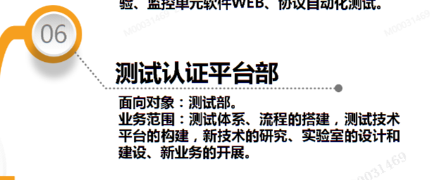

# 测试

## E_Learning测试介绍

主要内容:
- 测试部组织架构
- 测试理念
- 测试流程
- 测试平台
- 测试内容

### 1简介

测试的发展:手工测试-测试模型-**测试管理**-全面测试
测试管理: 推广基于IPD的PTM, 规范化,标准化

部门二级架构: 

部门三级架构:(软件测试部)

### 2测试理念

角色:
1. 作为第三方
1. 验证确认产品质量,验证产品满足需求,确认产品在预定环境能够使用.

原则:
1. 严格按照测试规范 测试用例执行
1. 过程独立;结果公平
1. 用例设计...覆盖使用场景与边界值

价值:
1. 产品质量
1. 竞争力
1. 用户体验

测试人员素养:
1. 理解产品:客户规格书,企业标准,行业标准,国家标准,国际标准材料特性,生产工艺,工程应用...
1. 掌握技能:正确 规范执行测试
1. 思考能力:定位缺陷,参与改进,综合评价
1. 创新能力:严格执行规范基础上,改进规范/用例
1. 复盘,输出案例

职业发展:技术/管理

能力等级:

### 3测试流程

产品过程:开发线与测试线并行,在每个开发环节进行测试.

1. 测试需求分析
1. 测试方案制定
1. 测试设计
1. 测试执行
1. 测试评审
1. 测试复盘

测试准入:
- 资源符合度:样机数量 仪器设备 外部环境 软件 后台
- 文档符合性: 产品技术规格书 技术方案 原理图...
- 流程
- 质量:完成研发自测和评审 用例设计完成

准出:
- 正常退出:测试项执行完毕 不合格项解决完成
- 异常退出:重大故障
- 测试终止:终止测试

 #### 测试缺陷管理

分类:轻微,一般,严重,致命.

扣分:一般问题-2,严重问题-6,致命问题-10,测试退回-20.

流程:提交流程->审核...

### 4测试平台

办公系统:
- TC: 提测流程和缺陷管理
- EIP: 转中试和量产管理,常用流程
- 阿里邮箱//钉钉: 日常交流,事件跟踪
- 奥博思(项目管理软件):
  - 一期测试提测流程 缺陷管理
  - 二期实现测试看板
  - 三期实现测试用例

体系:
- CNAS
- ISO26262

技术平台:(EIP->导航门户->知识中心->测试部)

### 5 测试内容

分类:

组织:

