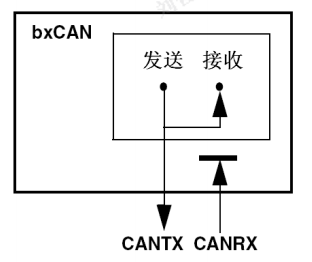

# 通信协议_can

## can

### 背景

- 2.0A给出了CAN报文标准格式，而2.0B给出了标准的和扩展的两种格式。
- 传统CAN与时间触发机制相结合产生了TTCAN（Time-Triggered CAN）

### 工作原理

- 串行通信总线，双绞线传输，（or光缆）
- 支持多主控制器
- CAN节点发送数据,广播到所有节点
- 报文,11位标识符(定义优先级),这种报文格式称为面向内容的编址方案
- 发送:CPU->CAN芯片->准备状态->总线分配->发送报文状态->报文格式
- 接受:接受格式->检测->处理
  >我们可以很容易地在CAN总线中加进一些新站而无需在硬件或软件上进行修改。当所提供的新站是纯数据接收设备时，数据传输协议不要求独立的部分有物理目的地址。它允许分布过程同步化，即总线上控制器需要测量数据时，可由网上获得，而无须每个控制器都有自己独立的传感器。
  >

### 特征

(1) **报文:**(Message) 总线上的数据以不同报文格式发送，但长度受到限制。当总线空闲时，任何一个网络上的节点都可以发送报文。

(2) **信息路由:**(Information Routing) 在CAN中，节点不使用任何关于系统配置的报文，比如站地址，由接收节点根据**报文本身特征**判断是否接收这帧信息。因此系统扩展时，不用对应用层以及任何节点的软件和硬件作改变，可以直接在CAN中增加节点。

(3) **标识符:**(Identifier) 要传送的报文有**特征标识符**(是数据帧和远程帧的一个域)，它给出的不是目标节点地址，而是这个报文本身的特征。信息以广播方式在网络上发送，所有节点都可以接收到。节点通过标识符判定是否接收这帧信息。

(4) **数据一致性:** 应确保报文在CAN里同时被所有节点接收或同时不接收，这是配合错误处理和再同步功能实现的。

(5) **位传输速率:**不同的CAN系统速度不同，但在一个给定的系统里，位传输速率是**唯一的**，并且是**固定的**。

(6) **优先权:** 由发送数据的报文中的标识符决定报文占用总线的优先权。标识符越小，优先权越高。

(7)**远程数据请求**(Remote Data Request) 通过发送远程帧，需要数据的节点请求另一节点发送相应的数据。回应节点传送的数据帧与请求数据的远程帧由相同的标识符命名。

(8)**仲裁:**(Arbitration) 只要总线空闲，任何节点都可以向总线发送报文。如果有两个或两个以上的节点同时发送报文，就会引起总线访问碰撞。通过使用标识符的**逐位仲裁**可以解决这个碰撞。
>仲裁的机制确保了报文和时间均不损失。当具有相同标识符的数据帧和远程帧同时发送时，*数据帧优先于远程帧*。
>在仲裁期间，每一个发送器都对发送位的电平与被监控的总线电平进行比较。
>如果电平相同，则这个单元可以继续发送，如果发送的是“隐性”电平而监视到的是“显性”电平，那么这个单元就失去了仲裁，必须退出发送状态。

(9)**总线状态:** 总线有“显性”和“隐性”两个状态，“显性”对应逻辑“0”，“隐性”对应逻辑“1”。
>“显性”状态和“隐性”状态 **与** 为“显性”状态，所以两个节点同时分别发送“0”和“1”时，总线上呈现“0”。
>CAN总线采用二进制不归零(NRZ)编码方式，所以总线上不是“0”，就是“1”。但是CAN协议并没有具体定义这两种状态的具体实现方式。

(10)**故障界定:**(Confinement):  CAN节点能区分瞬时扰动引起的故障和永久性故障。故障节点会被**关闭**。

(11)**应答:** 接收节点对正确接收的报文给出应答，对不一致报文进行标记。

(12)CAN通讯距离最大是10公里（设速率为5Kbps）,或最大通信速率为1Mbps(设通信距离为40米)。
(13)CAN总线上的节点数可达110个。通信介质可在双绞线，同轴电缆，光纤中选择。
(14)报文是短帧结构，短的传送时间使其受干扰概率低，CAN有很好的校验机制，这些都保证了CAN通信的可靠性。

### 特点

（1）具有实时性强、传输距离较远、抗电磁干扰能力强、成本低等优点；
（2）采用双线串行通信方式，检错能力强，可在高噪声干扰环境中工作；
（3）具有优先权和仲裁功能，多个控制模块通过CAN 控制器挂到CAN-bus 上，形成多主机局部网络；
（4）可根据报文的ID决定接收或屏蔽该报文；
（5）可靠的错误处理和检错机制；
（6）发送的信息遭到破坏后，可自动重发；
（7）节点在错误严重的情况下具有自动退出总线的功能；
（8）报文不包含源地址或目标地址，仅用标志符来指示功能信息、优先级信息。

### 协议内容

**总线竞争原则**

- 物理层（未定义）：物理层必须支持CAN总线中隐性位和显性位的状态特征
- 结构上：
  - 物理信号层(Physical Layer Signaling，PLS)、
  - 物理介质附件(Physical MediaAttachment，PMA)层
  - 介质从属接口(Media Dependent：Inter-face，MDI)层
  >其中PLS连同数据链路层功能由CAN控制器完成，PMA层功能由CAN收发器完成，MDI层定义了电缆和连接器的特性

**节点数量**
>CAN网络上的节点不分主从，任一节点均可在任意时刻主动地向网络上其他节点发送信息，通信方式灵活，利用这一特点可方便地构成多机备份系统，
>CAN只需通过报文滤波即可实现点对点、一点对多点及全局广播等几种方式传送接收数据，无需专门的"调度"。
>CAN的直接通信距离最远可达10km（速率5kbps以下）；通信速率最高可达1Mbps(此时通信距离最长为40m)。
>CAN上的节点数主要决定于总线驱动电路，目前可达110个；报文标识符可达2032种（CAN2.0A），而扩展标准（CAN2.0B）的报文标识符几乎不受限制。

**数据链路层**
CAN的数据链路层是其核心内容，其中逻辑链路控制(Logical Link control，LLC)完成过滤、过载通知和管理恢复等功能，媒体访问控制(Medium Access control，MAC)子层完成数据打包/解包、帧编码、媒体访问管理、错误检测、错误信令、应答、串并转换等功能。这些功能都是围绕信息帧传送过程展开的。

### 报文

**帧格式：**

- 11位标识符-标准帧
- 29位标识符-扩展帧
- 必须不加任何限制的支持标准格式

**帧类型：**

1. 数据帧
   - 由七种不同的位域(Bit Field)组成：
    1. 帧起始(Start of )、
    >由一个‘显性’位组成，
    >总线空闲，允许发送信号
    >所有的站点必须同步于首先开始发送报文的站点的帧起始前沿(该方式称为“硬同步”)。
    2. 仲裁域(Arbitration Field)、
    >标准:由11位标识符和RTR位组成--ID28~ID18
    >扩展:29位标识符、SRR位、IDE(Identifier Extension，标志符扩展)位、RTR位--ID28~ID0
    >IDE位,显性-标准帧.
    >仲裁域传输顺序为从最高位到最低位，其中最高7位不能全为零。RTR的全称为“远程发送请求(Remote TransmissionRequest)”。
    >RTR位在数据帧里必须为“显性”，而在远程帧里必须为“隐性”。它是区别数据帧和远程帧的标志。
    3. 控制域(Control Field)、
    >6位: 2个保留位(r0、r1同于CAN总线协议扩展)及4位数据长度码
    >允许的数据长度值为0～8字节
    4. 数据域(DataField)、
    >发送缓冲区中的数据按照长度代码指示长度发送。对于接收的数据，同样如此。它可为0～8字节，每个字节包含8位，首先发送的是MSB(最高位)。
    5. CRC域(CRC Field)、
    >由CRC域(15位)及CRC边界符(一个隐性位)组成
    >CRC计算中，被除的多项式包括帧的起始域、仲裁域、控制域、数据域及15位为0的解除填充的位流给定。
    >此多项式被下列多项式X15+X14+X10+X8+X7+X4+X3+1除(系数按模2计算)，相除的余数即为发至总线的CRC序列。
    >发送时，CRC序列的最高有效位被首先发送/接收。之所以选用这种帧校验方式，是由于这种CRC校验码对于少于127位的帧是最佳的。
    6. 应答域(ACK Field)、
    >应答域由发送方发出的两个(应答间隙及应答界定)隐性位组成
    >所有接收到正确的CRC序列的节点将在发送节点的应答间隙上将发送的这一隐性位改写为显性位。因此，发送节点将一直监视总线信号已确认网络中至少一个节点正确地接收到所发信息。应答界定符是应答域中第二个隐性位，由此可见，应答间隙两边有两个隐性位：CRC域和应答界定位。
    7. 帧结尾(End of )
    >每一个数据帧或远程帧均由一串七个隐性位的帧结束域结尾。这样，接收节点可以正确检测到一个帧的传输结束。
2. 错误帧
   由两个不同的域组成：第一个域是来自控制器的错误标志；第二个域为错误分界符。
    >1 错误标志：有两种形式的错误标志。
   激活(Active)错误标志。它由6个连续显性位组成。
   认可(Passive)错误标志。它由6个连续隐性位组成。
   它可由其他CAN总线协议控制器的显性位改写。
    >2 错误界定：错误界定符由8个隐性位组成。
    传送了错误标志以后，每一站就发送一个隐性位，并一直监视总线直到检测出1个隐性位为止，然后就开始发送其余7个隐性位。
3. 远程帧
   >有标准格式和扩展格式,与数据帧相比，远程帧的RTR位为隐性，没有数据域，数据长度编码域可以是0～8个字节的任何值，这个值是远程帧请求发送的数据帧的数据域长度。
   >当具有相同仲裁域的数据帧和远程帧同时发送时，由于数据帧的RTR位为显性，所以数据帧获得优先。发送远程帧的节点可以直接接收数据。
4. 过载帧
   过载帧由两个区域组成：过载标识域及过载界定符域。下述三种状态将导致过载帧发送：
    >1 接收方在接收一帧之前需要过多的时间处理当前的数据(接收尚未准备好)；
    >2 在帧空隙域检测到显性位信号；
    >3 如果CAN节点在错误界定符或过载界定符的第8位采样到一个显性位节点会发送一个过载帧。
    >

## bxCAN 控制器局域网

### 22.1 简介

- 基本扩展CAN 的缩写,它支持CAN协议2.0A和2.0B。
- 设计目标: 最小的CPU负荷
- 支持优先级软件配置

### 22.2 BxCAN 特点

- 支持2.0A,2.0B
- 1Mbps速度
- 支持时间触发TT_CAN
-
- 发送
  - 三个mail
  - 优先级
  - 时间戳
- 接收
  - FIFO
  - 过滤器组
  - 标识符列表
  - FIFO溢出处理
  - 时间戳
- 时间触发通信模式
- 管理
  - 中断
  - 邮箱
- 双CAN
  - CAN1,CAN2

### 22.3 bxCAN 总体描述

- 2.0B主动内核,
  - > 全自动收发, 支持11/29标识符
- 控制,状态,配置寄存器
  - >波特率,请求发送,处理接收,中断,诊断
- 3个发送邮箱
  - >优先级
- 28个 位宽可变 过滤器组
  - 2个接收FIFO
  - >每个存放3个报文, 由硬件管理

### 22.4 bxCAN工作模式

- 三个模式:初始化,正常,睡眠模式
  - 硬件复位-->睡眠模式,CANTX被上拉
  - CAN_MCR寄存器: 软件置位INRQ, SLEEP, 初始化/睡眠
- 进入初始化/睡眠后, 使INAK,SLAK置位,内部上拉禁用
- 进入正常模式前,取得同步
  - 等待CAN总线空闲(11个连续隐性位),达到同步

#### 初始化模式

- 置位INRQ
- 等待INAK=1
- 清除INRQ, 等待INAK=0
  - >禁止报文收发
  - >CANTX输出隐性
  - >软件对bxCAN的初始化，至少包括位时间特性(CAN_BTR)和控制(CAN_MCR)这2个寄存器。
  - >在对bxCAN的过滤器组(模式、位宽、 FIFO关联、激活和过滤器值)进行初始化前，软件要对CAN_FMR寄存器的FINIT位设置’1’。对过滤器的初始化可以在非初始化模式下进行。

#### 正常模式

#### 睡眠模式

### 22.5 测试模式

CAN_BTR寄存器的SILM/LBKM 置位
  >只能在初始化模式修改
  >
#### 静默模式

SILM=1

#### 环回模式

LBKM=1

#### 环回静默模式

SILM=1,,LBKM=1

### 22.6 调试模式

微控制器处于调试模式下: 配置bxCAN工作/停止

### 22.7 功能描述

#### 发送处理

- 应用 选择一个 **空置** 的发送邮箱
- 设置 标识符，数据长度和待发送数据
- TIxR->TXRQ=1, 请求发送
- >置位后,邮箱不可写
- 邮箱进入 **挂号** 状态,等待成为 最高优先级
- 成为最高优先级-->邮箱进入 **预定** 发送状态
- 一旦CAN总线空闲, 邮箱进入 **发送状态** (报文被发送)
- 成功发送后,邮箱进入 **空置** ,同时RQCP=1, TXOK=1
- 发送失败, 仲裁-->ALST=1; 错误-->TERR=1

> **发送优先级**
> 超过 1 个邮箱 *挂号* ,邮箱中报文的**标识符** 决定顺序
>
> - 根据CAN协议，标识符数值**最低**的报文具有最高的优先级。
> - 如果标识符的值相等，那么邮箱号小的报文先被发送
>
> 令TXFP=1,发送邮箱为 **FIFO**(先入先出)模式
>
> - 优先级由**发送请求次序**决定
> - 用于 分段发送

> **中止**
> 令ABRQ=1, 中止发送请求
>
> - 挂号/预定, 立即中止
> - 发送:
>   - 成功发送-->空置
>   - 发送失败-->预定-->中止-->空置

> **禁止自动重传**
> 满足时间触发通讯选项要求.令NART=1;
> 发送操作只进行一次, 仲裁/出错-->不会重传
> 同时,RQCP=1,
> TXOK,ALST,TERR,反应结果

#### 时间触发通信模式

...内部定时器在CAN位时间累加
...内部定时器在帧起始位生成时间戳

#### 接收管理

收到报文--> 3 级深度FIFO-->读取FIFO-->最先收到的报文

>**有效报文**
>
>- 直到EOF域的最后一位都没有错误
>- 通过标识符过滤

> **FIFO 管理**
>
> - 空状态-->收到第一个有效报文--->挂号1
> - PFR->FMP[1:0]=01,
>   - 读邮箱,并令RFR->RFOM=1, 释放邮箱
> - 收到第二个有效报文-->挂号2
> - PFR->FMP[1:0]=10,
> - ...
> - PFR->FMP[1:0]=11,

> **溢出**
> 导致溢出,FOVR=1,丢失一个报文
>
> - 禁用FIFO锁定(RFLM=0): 最后收到的报文被新报文覆盖
> - 启动FIFO锁定(RFLM=1): 新报文丢弃

> **接收中断**
> 收到报文-->FMP[1:0]更新-->FMPE=1?
> FIFO满-->FULL=1-->FFIE=1?
> 溢出-->FOVR=1-->FOVIE=1?

#### 标识符过滤

- 节点在接收报文时－根据标识符的值－决定软件是否需要该报文；如果需要，就拷贝到SRAM里；如果不需要，报文就被丢弃且无需软件的干预.
- 在互联型产品中， bxCAN控制器为应用程序提供了28个位宽可变的、可配置的过滤器组(27~0);
- 每个过滤器组x由2个32位寄存器， CAN_FxR0和CAN_FxR1组成

> **可变的位宽**
> 根据位宽不同,过滤器组可提供:
>
> - 1个32位
> - 2个16位
>
> 过滤器可以配置为:
>
> - 屏蔽位模式
> - 标识符模式

> **屏蔽位模式**
> 标识符寄存器和屏蔽寄存器一起，指定报文标识符的任何一位，应该按照“必须匹配”或“不用关心”处理

> **标识符列表模式**
> 在标识符列表模式下，屏蔽寄存器也被当作标识符寄存器用。
> 因此，不是采用一个标识符加一个屏蔽位的方式，而是使用2个标识符寄存器。
> 接收报文标识符的每一位都必须跟过滤器标识符相同

> **过滤器组位宽和模式的设置**
>
> - 配置前: 清除CAN_FAR寄存器的FACT
> - 设置CAN_FS1R的相应FSCx位，可以配置一个过滤器组的位宽
> - CAN_FMR的FBMx位，可以配置对应的屏蔽/标识符寄存器的标识符列表模式或屏蔽位模式
>
> 为了过滤出一组标识符，应该设置过滤器组工作在屏蔽位模式。
为了过滤出一个标识符，应该设置过滤器组工作在标识符列表模式
> 不使用, 应保持禁用

> **过滤器匹配序号**
> 根据过滤器优先级规则，过滤器匹配序号和报文一起，被存入邮箱中

> **过滤器优先级规则**
>
> - 位宽为32位的过滤器，优先级高于位宽为16位的过滤器
> - 对于位宽相同的过滤器，标识符列表模式的优先级高于屏蔽位模式
> - 位宽和模式都相同的过滤器，优先级由过滤器号决定，过滤器号小的优先级高

#### 报文存储

邮箱是软件和硬件之间传递报文的接口。邮箱包含了所有跟报文有关的信息：标识符、数据、控制、状态和时间戳信息

> **发送邮箱**
>
> - 选择空邮箱
> - 配置信息
> - 发送请求
> - 发送状态(CAN_TSR寄存器)

> **接收邮箱**
>
> - 读取FIFO
> - 令RFOM=1
> - 释放报文
> - 匹配序号存放在FMI[]
> - 时间戳存放在TIME[]

#### 出错管理

- 当TEC大于255时， bxCAN就进入离线状态，同时CAN_ESR寄存器的BOFF位被置’1’。在离线状态下， bxCAN无法接收和发送报文。
- bxCAN都必须等待一个CAN标准所描述的恢复过程(CAN RX引脚上检测到128次11个连续的隐性位)。
  - 如果ABOM位为’1’，
  - 如果ABOM位为’0’，

#### 位时间特性

每一位的同步与采样

各种帧

### 22.8 bxCAN 中断
