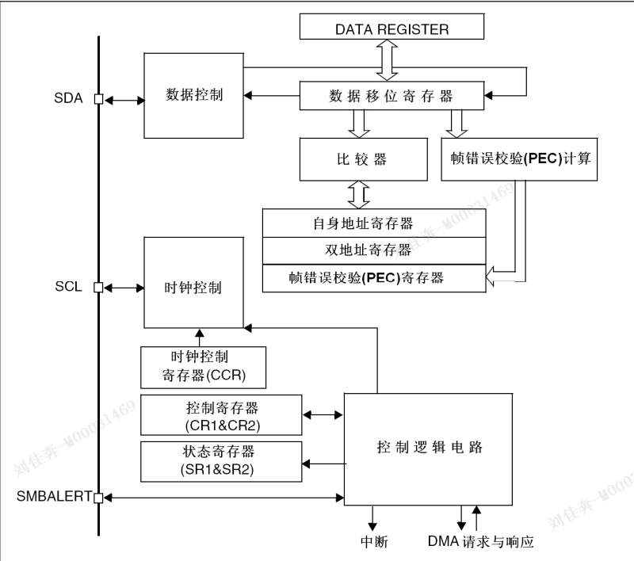
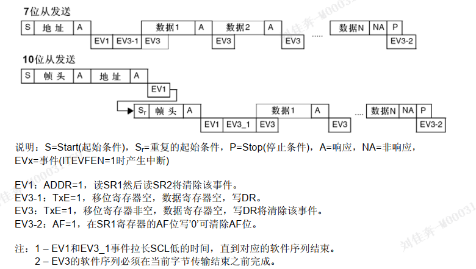
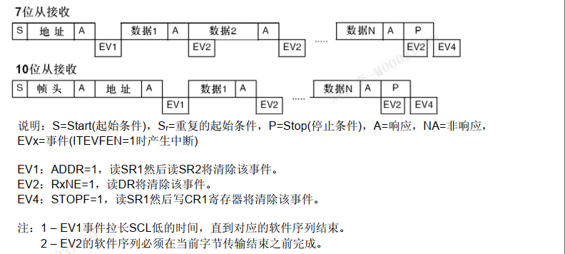
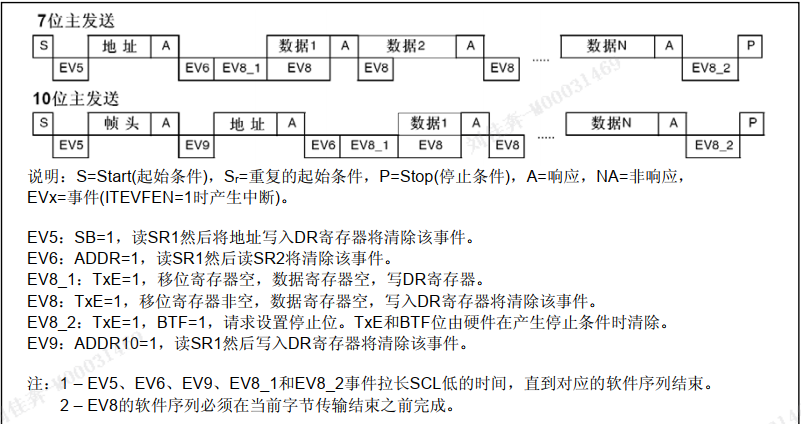
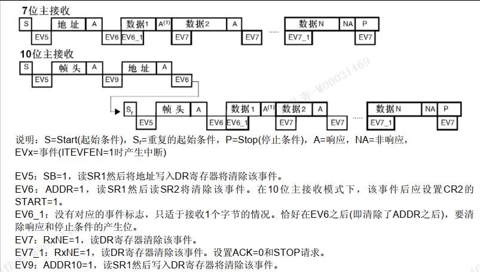
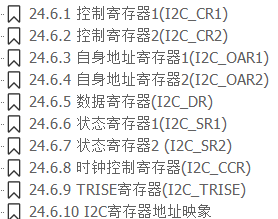

# 通信协议iic

## iic
### 简介
- I2C,一种总线结构
- 可实现多主机系统所需的裁决和高低速设备同步等功能。因此，这是一种高性能的串行总线。

### 硬件结构
- 两根线: 双向SDA数据线...SCL时钟线
- 各设备连接到总线的输出端时必须是漏极开路（OD）输出或集电极开路（OC）输出。
- 设备SDA接口电路是双向的
- 设备时钟线SCL也是双向的
  - 主机: 通过SCL发送时钟信号...检测总线SCL决定发送下一个时钟脉冲电平.
  - 从机: 根据SCL信号接收数据...向SCL发出低电平 延长总线时钟信号周期.
- >总线空闲时，因各设备都是开漏输出，上拉电阻Rp使SDA和SCL线都保持高电平。任一设备输出的低电平都将使相应的总线信号线变低，也就是说：各设备的SDA是“与”关系，SCL也是“与”关系。
- 400k
- >总线上允许连接的设备数以其电容量不超过400pF为限。
- 总线由主机控制,(发出启动信号,时钟,停止信号),
- 总线允许多个处理器和设备: 如存储器、LED及LCD驱动器、A/D及D/A转换器.
- 任一时刻,总线由一台主机控制,
- 总线控制权?

### 数据传输
- 开始条件: SCL保持'高',SDA由 **“高”变为“低”** 为开始条件
- 停止条件: SCL保持“高”,SDA由 **“低”变为“高”** 为停止条件
- 条件判断: 硬件接口实现/每时钟周期两次采样实现
- SCL变低时,SDA状态开始改变,
- 每个字节必须是8位,字节不受限制,
- 每个字节一个应答ACK
- 接收器中断: 保持SCL位低,促使发送器 等待...释放SCL,传输继续
- 应答: 
  - 时钟脉冲由主控制器产生
  - 发送器: 应答期间下拉SDA
  - 被控器件不能应答时,数据保持为高,主控器产生停止条件
  
## iic

### 通信流:
  - 主模式:启动数据传输并产生时钟信号。串行数据传输总是以起始条件开始并以停止条件结束。起始条件和停止条件都是在主模式下由软件控制产生。
  - 从模式时， I2C接口能识别它自己的地址(7位或10位)和广播呼叫地址。软件能够控制开启或禁止广播呼叫地址的识别。
  - 数据和地址按8位/字节进行传输，高位在前。跟在起始条件后的1或2个字节是地址(7位模式为1个字节， 10位模式为2个字节)。地址只在主模式发送。
  - 在一个字节传输的8个时钟后的第9个时钟期间，接收器必须回送一个应答位(ACK)给发送器。参考下图
  - 开始条件: SCL保持'高',SDA由 **“高”变为“低”** 为开始条件
  - 停止条件: SCL保持“高”,SDA由 **“低”变为“高”** 为停止条件

#### 从模式
- 检测到起始条件->SDA接收的地址->移位寄存器->与芯片自己的地址OAR1和OAR2(当ENDUAL=1)或者广播呼叫地址(如果ENGC=1)相比较
- 头段或地址不匹配： I2C接口将其忽略并等待另一个起始条件。
- 头段匹配(仅10位模式)：如果ACK位被置’1’， I2C接口产生一个应答脉冲并等待8位从地址。
- 地址匹配： I2C接口产生以下时序：
  - 如果ACK被置’1’，则产生一个应答脉冲
  - 硬件设置ADDR位；如果设置了ITEVFEN位，则产生一个中断
  - 如果ENDUAL=1，软件必须读DUALF位，以确认响应了哪个从地址。
- 10位模式,总是处于接收器模式.条件-发送器模式
- TRA位指示: 当前模式

#### 从发送器
- 接收到地址,清除ADDR->字节数据由DR经移位寄存器发送到SDA
- 收到应答->TxE=1
- 停止

#### 从接收器
- 接收到地址,清除ADDR->字节数据由SDA存入DR->
  - 应答
  - 置位RxNE=1
  - 停止

#### 主模式
- 产生起始条件--->产生停止条件
- 操作顺序
  - 寄存器->设定输入时钟
  - 时钟控制寄存器
  - 上升时间寄存器
  - 启动外设
  - 产生起始条件
- 输入时钟频率
  - 普通: 2MHz
  - 快速: 4MHz
- 起始条件:
  - BUSY=0时，设置START=1，产生开始条件->
  - SB位被硬件置位
- 从地址发送:
  - 从地址 由移位寄存器->SDA
    - 7位
    - 10位
  - 进入 对应模式
    - 7位
    - 10位

#### 主发送器
- 发送地址,清除ADDR -> 字节由DR发送到SDA
- 等待TxE被清除
- 收到应答:
  - TxE置=1 ->条件:BTF=1
- 设置停止位

#### 主接收器
- 发送地址,清除ADDR -> 字节由SDA发送到DR
- 发出应答
- 硬件RxNE=1 ->条件:BTF=1,
- 应答NACK,(在读倒数第二个数据后,完成配置)

### 错误条件
- 总线错误BERR
  - 传输期间,外部停止/起始条件
- 应答错误AF
  - 无应答位
- 仲裁丢失ARLO
  - 仲裁丢失
- 过载/欠载错误OVR
  - 禁用时钟延长:
  - 接收数据时, DR上一个数据未读出
  - 发送数据时, 新数据未写入DR
### SDA/SCL线控制
- 允许时钟延长:
  - 发送器: 如果TxE=1且BTF=1： I2C接口在传输前保持时钟线为低，以等待软件读取SR1，然后把数据写进数据寄存器(缓冲器和移位寄存器都是空的)。
  - 接收器: 如果RxNE=1且BTF=1： I2C接口在接收到数据字节后保持时钟线为低，以等待软件读SR1，然后读数据寄存器DR(缓冲器和移位寄存器都是满的)。
- 禁用时钟延长:
  - RxNE=1，在接收到下个字节前DR还没有被读出，则发生过载错。
  - TxE=1，在必须发送下个字节之前却没有新数据写进DR，则发生欠载错。
  - 不控制重复写冲突
### SMBus

- 介绍
  - 系统管理总线(SMBus)是一个双线接口。
  - SMBus为系统和电源管理相关的任务提供一条控制总线。
  - 系统管理总线(SMBus)标准涉及三类设备:从设备,主设备,主机.
  - 主机必须具有主-从机功能并且必须支持SMBus提醒协议。一个系统里只允许有一个主机。
- 相似点
- 不同点
- 用途
- 设备标识
- 总线协议
- 地址解析协议(ARP)
- 唯一的设备标识符(UDID)
- SMBus提醒模式
- 超时错误
- 使用SMBus模式的接口

### DMA请求
>DMA请求(当被使能时)仅用于数据传输。
>发送时数据寄存器变空或接收时数据寄存器变满，则产生DMA请求。
> DMA请求必须在当前字节传输结束之前被响应。
> 当为相应DMA通道设置的数据传输量已经完成时， DMA控制器发送传输结束信号ETO到I2C接口，并且在中断允许时产生一个传输完成中断：
>- 主发送器：在EOT中断服务程序中，需禁止DMA请求，然后在等到BTF事件后设置停止条件。
>- 主接收器: 

- DMA发送
  - 设置I2C_CR2寄存器中的DMAEN位可以激活DMA模式
  - 当TxE=1,自动装载DR
  - 需要分配DMA通道
- DMA接收
  - 设置I2C_CR2寄存器中的DMAEN位可以激活DMA模式
  - 接收到数据, 将DR存到设置的存储区
  - 

### 包错误校验 PEC
计算器使用下述CRC-8多项式对每一位串行数据进行计算
`C(x) = x8 + x2 + x + 1`
- PEC计算由I2C_CR1寄存器的ENPEC位激活
- 在I2C_SR1寄存器中可获得PECERR错误标记/中断
- 如果DMA和PEC计算器都被激活：
  - ....
- 为了允许中间PEC传输，在I2C_CR2寄存器中有一个控制位(LAST位)用于判别是否真是最后一个DMA传输。
- 仲裁丢失时PEC计算失效。

### I2C中断请求
事件中断： ITEVFEN
错误中断： ITERREN
缓冲区相关： ITBUEN

### I2C调试模式
- 控制器进入调试模式，根据DBG模块中的DBG_I2Cx_SMBUS_TIMEOUT配置位， SMBUS超时控制或者继续正常工作或者可以停止。
### I2C寄存器描述

