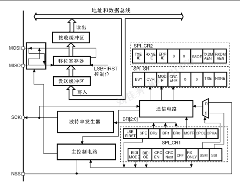

# 通信协议――spi
>串行外设接口(Serial Peripheral Interface)是一种同步外设接口，它可以使单片机与各种外围设备以串行方式进行通信以交换信息。外围设备包括Flash RAM,网络控制器、LCD显示驱动器、A/D转换器和MCU等。
- 同步
- 串行
- flash

## SPI

### 发展
- 首先提出的全双工三线同步串行外围接口
- 采用主从模式,支持多个从设备
- 广泛应用于MCU和外设模块如E2PROM、ADC、显示驱动器等
- SPI接口是一种事实标准

### 原理

- 构成系统:
  - 一个主,几个从控制器
  - 几个从控制器相互连接-多主机
  - 一个主,几个从IO设备
- 数据格式: 高位在前,低位在后
### 组成
- 四条线:
  - 串行时钟线(SCK)
    - 串口时钟，作为主设备的输出，从设备的输入
  - 主机输入/从机输出数据线(MISO)
    - 该引脚在从模式下发送数据，在主模式下接收数据
  - 主机输出/从机输入数据线(MOSI)
    - 该引脚在主模式下发送数据，在从模式下接收数据
  - 低电平有效的从机选择线(NSS)
    - 片选引脚
- SPI是一个环形总线结构，由NSS、SCK、MISO、MOSI构成，NSS引脚设置为输入，MOSI引脚相互连接，MISO引脚相互连接，数据在主和从之间串行地传输(MSB位在前)。
### 工作方式

#### 主模式
- SPI为其他节点的SPI CLK引脚提供串行时钟
- 数据从SPI SIMO引脚输出
- 从SPI SOMI引脚输入
- 主控制器写数据到寄存器SPI TXBUF
- SPI TXBUF--->SPI DAT--->SPI SIMO
- 接收到的数据--->SPI SOMI--->SPI DAT低位--->SPI RXUBF
- >通过SPISIMO引脚发送的SPIDAT的数据最高位每移出一位后就会从SPISOMI引脚移人一位到SPIDAT最低位

#### 从模式
- 数据出--->SPI SOMI
- SPI SIMO--->数据入
- SPI CLK串行移位时钟的输入

------

## SPI串行外设接口
### 简介
- 大容量,互联型: SPI接口可配置为SPI/IIS,默认为SPI
  - 小,中,不支持IIS
- 串行外设接口(SPI)允许芯片与外部设备以半/全双工、同步、串行方式通信
- 接口可配置为:主模式
  - 为从设备提供时钟SCK
- 可以多主配置方式工作
- 可以用于: 
  - 使用一条双向数据线的双线单工同步传输
  - 使用CRC校验的可靠通信

>- I2S也是一种3引脚的同步串行接口通讯协议。
>- 飞利浦I2S标准， MSB和LSB对齐标准，以及PCM标准
>- 在半双工通讯中，可以工作在主和从2种模式下。当它作为主设备时，通过接口向外部的从设备提供时钟信号
- 部分引脚与JTAG共用

### 主要特征
spi
- 三线全双工同步
- 带或不带第三根双向数据线的双线单工同步传输
- 8或16位帧
- 8个主模式波特率预分频系数
- 硬件和软件的NSS管理:
  - 主从模式的动态改变
- 可编程的:
  - 时钟极性和相位
  - 数据顺序
- DMA收发缓冲器

IIS
- 单工
- 8位预分频器
- 数据格式: 16,24,32
- 可编程时钟极性
- DMA能力互联型: 专用PLL3

### SPI功能

#### 概述

单主单从:
- MOSI相互连接,MISO相互连接
- 高位在前
- 主设备发起->数据->MOSI->从设备
- 从设备->数据->MISO->主设备
- 均使用主设备的SCK脚时钟

NSS从选择
- 软件: SPI_CR1_SSM,使能,可以它用,SSI驱动
- 硬件: 
  - 主SPI,并SSOE使能-->拉低,外设变从设备
  - NSS关闭
时钟相位和极性
> 由SPI_CR的CPOL/CPHA控制
- CPOL控制极性:时钟空闲状态电平
- CPHA控制相位:
  - CPOL=0:低电平
  - CPOL=1:高电平
  - CPHA=1:第二个边沿
  - CPHA=0:第一个边沿
- CPOL时钟极性和CPHA时钟相位的组合选择数据捕捉的时钟边沿

#### 从模式
- DFF定义数据帧格式:8/16
- CPOL,CPHA,主从定义相同
- 帧格式相同(LSBFIRST)
- NSS配置
  - 硬件:传输过程中NSS拉低
  - 软件:设置SSM,并清除SSI
- 清除MSTR,设置SPE,工作在SPI

数据发送
- 数据-->并行写入发送缓冲器
- 收到时钟信号-->MOSI出现第一个数据位-->发送开始
- 余下位-->装入移位寄存器
- 发送缓冲器中的数据传输到移位寄存器时,TxE=1

数据接收
- 接收完成
  - 移位寄存器数据-->接收缓冲器,RxE=1
  - 条件:中断
- 最后一个采样时钟后,RxNE=1,移位寄存器数据写入接收缓存器
- 读SPI_DR,RXNE清除

#### 主模式
- SPI_CR1_BR[2:0],定义时钟波特率
- CPOL,CPHA, 定义配置
- DFF定义数据帧格式:8/16
- LSBFIRST
- NSS配置
  - 硬件:传输期间,NSS拉高
  - 软件: 设置SSM,SSI,/SSOE
- MSTR和SPE
  
数据发送
- 数据写入缓冲器,发送开始
- 发送第一个数据位-->数据并行传入移位寄存器-->串行移出到MOSI
- 数据进入移位寄存器,TE=1

数据接收
- 接收完成
  - 移位寄存器数据-->接收缓冲器RXNE=1
  - 条件: 中断
- 最后采样时钟沿,RXEN=1,数据到接收缓冲器
- 读SPI_DR,清除RXN

#### 配置SPI为单工通信
- 1条时钟线和1条双向数据线；
- 1条时钟线和1条数据线(只接收或只发送)；

#### 数据发送与接收
主模式下开始传输:

从模式下开始传输:

---
- 设置SPE=1,使能SPI
- DR寄存器,写入第一个数据(清除TXE)
- 等待TXE=1, 写入第二个数据
- 等待RXNE=1, 读出DR,获得第一个数据
- ...发送n,接收n-1
- 等待RXNE=1, 接收最后一个
- 等待TXE=1, 在BSY=0后关闭SPI

#### CRC计算
- 使能CRCEN位,在采样时钟沿计算
- 设置了SPI_CR1的CRCNEXT位, SPI_TXCRCR的内容将在当前字节发送之后发出
- 传输SPI_TXCRCR的内容时，如果在移位寄存器中收到的数值与SPI_RXCRCR的内容不匹配，则SPI_SR寄存器的CRCERR标志位被置1

CRC配置
- 设置CPOL, CPHA, LSBFIRST, BR, SSI, MSTR
- SPI_CRCPR输入多项式
- 使能CRCEN,
- 设置SPE, 启动SPI
- 最后一个字节写入缓冲器时,设置CRCNext位,
- 发送最后一个字节,并发送CRC,清除CRCNext
- 接收CRC,比较,不同-->设置CRCERR

#### 状态标志

#### 关闭SPI

#### 利用DMA的SPI通信

#### 错误标志

#### SPI 中断

### IIS 功能

### SPI 寄存器

